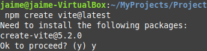
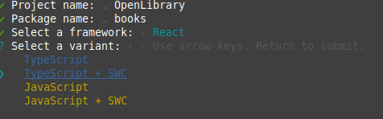

# Que es API REST

Una API (interfaz de programación de aplicaciones) es un conjunto de protocolos, rutinas y herramientas que permiten que **diferentes aplicaciones de software se comuniquen entre sí.** Una API actúa como un mensajero que recibe una solicitud de una aplicación y devuelve una respuesta a la aplicación solicitante.

Una API abierta significa que está disponible públicamente y que los desarrolladores pueden utilizar para crear aplicaciones de software. Una API abierta normalmente incluye documentación y herramientas de desarrollo para ayudar a los desarrolladores a comprender cómo utilizar la API.

`REST (Representational State Transfer)`es un estilo arquitectónico de software para crear servicios web. Se basa en HTTP (Protocolo de transferencia de hipertexto) y se usa comúnmente para crear API. Una **API RESTful** permite que diferentes aplicaciones de software se comuniquen entre sí **mediante métodos HTTP como GET, POST, PUT y DELETE para acceder y manipular datos.**

[openlibrary.org](https://openlibrary.org/)


El proyecto Open Library tiene como objetivo crear una página web para cada libro jamás publicado. La API permite a los desarrolladores recuperar información sobre libros, autores, temas y más.

*Documentación:* [Developer Center / APIs | Biblioteca Abierta](https://openlibrary.org/developers/api)

**Stack technologies para mi proyecto:**

1. **Vite**: Empaquetador de aplicaciones web. Una alternativa al webpack de React.
   
   **Vite nos permite usar frameworks** como por ejemplo react.js, vue.js y algunos otros como lit o svelte, a la vez que tenemos todas las ventajas de Vite. En este caso vamos a crear un proyecto con React y ver lo sencillo que es.
   
   Una vez se generado el proyecto solo faltaría instalar las dependencias.
   
   Es una herramienta de compilación que tiene como objetivo proporcionar una experiencia de desarrollo más rápida y ágil para proyectos web modernos. Consta de dos partes principales:
   
   * Un servidor de desarrollo que proporciona [mejoras enriquecidas de funcionalidades](https://es.vitejs.dev/guide/features) sobre [módulos ES nativos](https://developer.mozilla.org/en-US/docs/Web/JavaScript/Guide/Modules), por ejemplo [Hot Module Replacement (HMR)](https://es.vitejs.dev/guide/features#hot-module-replacement) extremadamente rápido.
   
   * Un comando de compilación que empaqueta tu código con [Rollup](https://rollupjs.org/), preconfigurado para generar recursos estáticos altamente optimizados para producción.
   
   * Página de documentación oficial: [Introducción | Vite](https://es.vitejs.dev/guide/)

2. **SWC**:  En el contexto de Vite y JavaScript, SWC se refiere a “**Super-fast Web Compiler**”.
   
   SWC es un proyecto de código abierto que proporciona un compilador JavaScript/TypeScript extremadamente rápido y eficiente

3. **Axios** es un Cliente HTTP [*basado en promesas*](https://javascript.info/promise-basics) para [`node.js`](https://nodejs.org/) y el navegador. Es [*isomorfico*](https://www.lullabot.com/articles/what-is-an-isomorphic-application) (puede ejecutarse en el navegador y nodejs con el mismo código base). En el lado del servidor usa el modulo nativo `http` de node.js, mientras que en el lado del cliente (navegador) usa XMLHttpRequests.
   
   Página de documentación oficial: [Empezando | Axios Docs](https://axios-http.com/es/docs/intro)
   
   - Por último instanciaré una de dependencia de **Axios** para la comunicación de la APIRest.

---

1. Vite + React `npm create vite@latest`. Creo que como es la primera vez que inicio el vite me pide instalar el paquete con la versión 5.2.0 Imgino que es el la versión latest stable.
   
   

2. JavaScript + SWC.
   
   

3. Instalo las dependencias de React con `npm install` y las de Axios con `npm install axios`.

4. Con `npm run dev` levanto la aplicación en el navegador. 
   
   * http://localhost:5173/
     
     

Viene con un boton de pulsos y compruebo que funcione. con 5 basta (^^,)

Y ya tengo todo listo, la esctructura de carpetas se muestra así:


#### main.jsx

Es la entrada a la aplicación. La ruta se lee desde el index.html > main.jsx > App.jsx (este llamará al componente <BookList />) y todo vuelve hasta renderizar el id root que existe en el body de index.html.


También tendremos un componente *App.jsx* para mostrar la portada.

Compruebo que se han instalado correctamente las dependencias:


En la documentación de *OpenLibrary* se menciona el link donde debemos solicitar el servicio API y algunos ejemplos para crear la ruta:

---

#### Endpoint

The endpoint for this API is:  

<mark>https://openlibrary.org/search.json</mark>

#### Examples

The URL format for API is simple. Take the search URL and add `.json` to the end. Eg:

* https://openlibrary.org/search.json?q=the+lord+of+the+rings  

* https://openlibrary.org/search.json?title=the+lord+of+the+rings  

* https://openlibrary.org/search.json?author=tolkien&sort=new  

* https://openlibrary.org/search.json?q=the+lord+of+the+rings&page=2  

* https://openlibrary.org/search/authors.json?q=twain# 

---

Ahora crearé el componente BookList.jsx y el endpoint será para recuperar 100 libros.

```javascript
import React, { useState, useEffect } from 'react';
import axios from 'axios';

const BookList = () => {
  const [books, setBooks] = useState([]);
  const [isLoading, setIsLoading] = useState(true);

  useEffect(() => {
    const fetchBooks = async () => {

        const response = await axios.get(
          'https://openlibrary.org/search.json?q=harry%20potter&fields=*,availability&limit=3'
        );
        const booksData = response.data.docs;
        setBooks(booksData);
        setIsLoading(false);
    };
    fetchBooks();
  }, []);

  return (
    <>
        <h1>Books</h1>
        {isLoading ? (<p>Loading...</p>) : (
        <section>
            {books.map((book) => (
            <ul key={book.key}>        
                <li><b>Title: </b> {book.title} <br /></li>
                <li><b>Author: </b> {book.author_name}<br /></li>
                <li><b>Number of editions: </b> {book.edition_count}</li>
                <li><b>Year:</b> {book.first_publish_year} <br /></li>
                <li><b>ISBN: </b> {book.isbn[0]} <br /></li>
            </ul>
            ))}
        </section>
        )}
    </>
  );
};

export default BookList;
```

Modifico el componente *App.jsx* para usarlo el *main.jsx* llamando al componente BookList que hemos creado:

```javascript
import React from "react";
import BookList from "./BookList";

function App() {
  return (
    <>
      <BookList />
    </>
  );
}

export default App;
```

Y ahora ya si, inicio la aplicación con `npm run dev`.

He colocado algún estilo a mi gusto.

/home/jaime/MyProjects/Documents/DAW/APIRest/

```javascript
        <section>
            {books.map((book) => (
            <ul key={book.key}>
                <li><b>Title: </b> {book.title} </li>
                <li></li>
                <li><b>Year:</b> {book.first_publish_year} </li>
                <li><b>Number of editions: </b> {book.edition_count}</li>
                <li><b>Author: </b>{book.author_name}</li>
                <li></li>
                <li><b>ISBN: </b> {book.isbn[0]} </li>
            </ul>
            ))}
        </section>
```

Solo queda manejar los errores con el **try catch** y el componente BookList queda de la siguiente manera:

```javascript
import React,{useState, useEffect} from 'react'
import axios from 'axios'
import { getImageUrl } from './utils.js';
import { getAuthorUrl } from './utils.js';

const BookList = () =>{
    const [books, setBooks]= useState([]);
    const [isLoading, setIsLoading] = useState(true);
    const [isError, setIsError] = useState(false);

    useEffect(() =>{
        const fetchBooks = async () =>{
            try{
                const response = await axios.get(
                    'https://openlibrary.org/search.json?q=harry%20potter&fields=*,&limit=5'
                )
            const booksData = response.data.docs;
            setBooks(booksData)
            setIsLoading(false)
            }catch (error){
                setIsError(true)
                setIsLoading(false)
            }
        };
        fetchBooks()
    }, [])

    return (
        <>
        <h1>Books</h1>
        {isLoading && !isError && <p>Loading...</p>}
        {!isLoading && isError && <p>Error: Could not fetch books</p>}
        {!isLoading && !isError && (
        <section>
            {books.map((book) => (
            <ul key={book.key}>
                <li><b>Title: </b> {book.title} </li>
                <li></li>
                <li><b>Year:</b> {book.first_publish_year} </li>
                <li><b>Number of editions: </b> {book.edition_count}</li>
                <li><b>Author: </b>{book.author_name}</li>
                <li></li>
                <li><b>ISBN: </b> {book.isbn[0]} </li>
            </ul>
            ))}
        </section>
        )}
        </>
    )
}
export default BookList
```