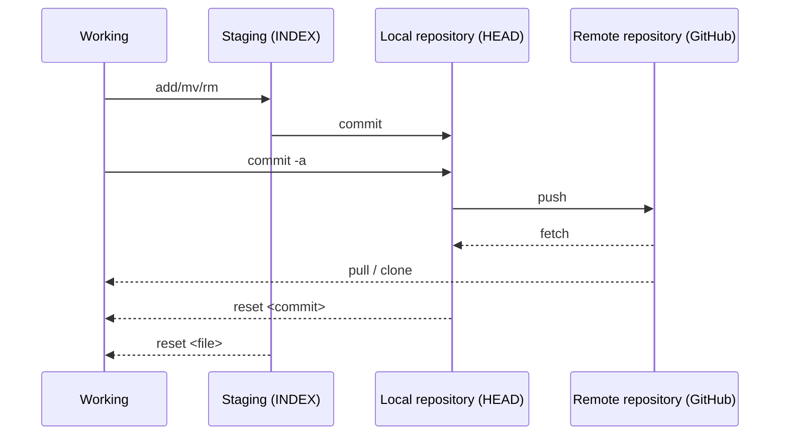

# Comandos por consola de git

### Git y GitHub

    Un breve comentario: git y GitHub ***no*** son lo mismo. 

    **Git** *es una herramienta* de control de versiones de código abierto creada en 2005 por desarrolladores que trabajan en el sistema operativo Linux. 

    **GitHub** *es una empresa* fundada en 2008 que fabrica herramientas que se integran con git. No necesitas GitHub para usar git, pero no puedes usar GitHub sin usar git. 

>     Existen muchas otras alternativas a GitHub, como GitLab, BitBucket y soluciones de “alojamiento propio” como gogs y gittea. Todos estos se denominan en git-speak "controles remotos" y todos son completamente opcionales. No necesitas usar un control remoto para usar git, pero hará que compartir tu código con otros sea más fácil.
> 
> [An Intro to Git and GitHub for Beginners (Tutorial)](https://product.hubspot.com/blog/git-and-github-tutorial-for-beginners)

### Comandos principales

#### Herramientas de repositorio git

    `git` es una herramienta de línea de comandos de código abierto que se utiliza para gestionar versiones de código fuente en un repositorio Git.     Con `git`, puedes realizar una variedad de operaciones, como inicializar un nuevo repositorio, realizar seguimiento de cambios en archivos, crear y fusionar ramas, trabajar con repositorios remotos, entre otras cosas.

     Es una herramienta fundamental para cualquier desarrollador que trabaje con Git y es ampliamente utilizada en la comunidad de desarrollo de software.

* **Ejercicios GitBranching online**: [Learn Git Branching](https://learngitbranching.js.org/?locale=es_ES)
  
  Lo malo que tiene es que guarda los resultados por coockies de sesión. Por lo que se puede perder el progreso si se borran los datos de navegación
  
  Esquema secuencial de acceso al repositorio Git:



**git init**

    Crea o reinicia un repositorio Git existente en uno nuevo en el *working-area*.

**git add**

    Coloca los archivos de trabajo actuales en el escenario *staging-area* (también conocido como índice o caché).

> **git add .** ejecuta lo mismo que **git add --all**
> 
> **git add fichero.txt**

**git remote add origin** (git remote add )

    Agrega el repositorio remoto especificado.

    Estás configurando el repositorio remoto para tu repositorio Git local.

    El comando asocia su repositorio Git local con el repositorio GitHub que creó anteriormente. Esto le permite enviar sus confirmaciones locales al repositorio remoto en GitHub.

> **git remothttps://github.com/user/newurl.gite -v** Lista el fetch y el push origin del remoto vinculado.
> 
>     origin `https://github.com/user/url.git` (fetch)     
> 
>     origin `https://github.com/user/url.git` (push)
> 
> **git remote set-url origin https://github.com/user/newurl.git** Actualiza la url de origen.

**git status**

    Verifica el estado de los cambios en el stage.

**git log**

    Muestra un registro de los commits realizados en un repositorio cronológicamente desde el comit más reciente.

**git ls-remote**

    Enumera todas las referencias en el repositorio remoto, incluidas las sucursales.

**git remote show [remote_name]**

    Muestra información sobre el control remoto especificado, incluidas las sucursales remotas.

**git remote remove origin**

   Se suele ejecutar después de resolver un clone de otro repositorio *ajeno*. Desvincula del remoto descargado

**git commit**

    Confirma cambios por etapas a un *staging-area o *HEAD*

> **git commit -m** *"commit contains message"* permite especificar un mensaje de confirmación en la misma línea de comando. **git commit -a** (abreviado de "all") envía todos los archivos modificados al *staging-area* del local de (abreviatura de "*git add*" y "*git commit*").
> 
> **git commit -am *"commit contains message"*** Git agregará automáticamente todos los archivos modificados al área de preparación y realizará el commit con el mensaje especificado

**git fetch**

    Descarga cambios desde un repositorio remoto al clon local. Sólo recupera los cambios del repositorio remoto pero no los fusiona automáticamente en su sucursal local.

    Esto es útil cuando desea inspeccionar los cambios antes de integrarlos en su rama. Le permite revisar los cambios y decidir cuándo y cómo fusionarlos.

> git fetch origin

**git pull**

    Recupera cambios remotos en el clon local y los combina con los archivos de trabajo actuales. Es una combinación de dos operaciones: git fetch seguido de git merge .

    Esto puede ser conveniente para una actualización rápida, pero puede provocar fusiones automáticas, lo que podría generar conflictos que deba resolver.

> *git pull origin main*

**git merge**

    Fusionar uno o más ramas dentro de la rama que tienes activa. A continuación avanzará la rama actual al resulta$do de la f$usión.

**git pull request**

    Solicita la revision de lo cambios a fusionar con la rama principal del proyecto. Seguido se debe realizar un merge para realizar la fusión. Esto combinará los cambios de la rama con los cambios existentes en la rama principal (master).

***git pull*** y ***git fetch*** son dos comandos comúnmente utilizados para actualizar el repositorio local con cambios desde un repositorio remoto. Tienen propósitos similares pero funcionan de maneras ligeramente diferentes.

**git rm --cached archivo.txt**

    Esto elimina el archivo del área de preparación *staging-area* y lo quita del seguimiento, pero se queda en el sistema de archivos *working-area*.

**git push**

    Carga cambios de las sucursales locales a los respectivos repositorios remotos.

> git push origin master

**git reset**

    Hace que la rama actual apunte a alguna revisión o rama específica.

> **git reset --hard** hace que la rama actual apunte a alguna revisión o rama específica y reemplaza los archivos de trabajo actuales con los archivos de esa rama.

**git branch**

    Tiene varios usos. Muestra la rama donde estoy.

> **git branch -M** renombra la rama actual en un repositorio. Por ejemplo cambiar de `main` a `develop`.
> 
> **git branch -r** lista todas las ramas remotas.
> 
> **git branch -r -v** enumera todas las ramas remotas con el último hash de confirmación y el mensaje de confirmación.
> 
> **git branch -a** muestra todas las ramas locales y remotas.    
> 
> **git branch** crea una nueva rama o mueve el HEAD (puntero) a otro commit:
> 
> > **git branch -f main HEAD ~ 3** en este ejemplo moveria el puntero a 3 padres atrás.
> > 
> > **git branch -f main C6** en este ejemplo moveria el puntero al commit con hash C6.

**git checkout**

    Reemplaza los archivos de trabajo actuales con archivos de una rama.

> **git checkout --track** crea una rama local a partir de una rama remota, las vincula y reemplaza los archivos de trabajo actuales con archivos de esa rama.

**git merge**

    Fusiona archivos de una rama determinada en la rama actual.

**git rebase**

**git revert HEAD**

    El revert se usa en remoto donde otras personas utilizan el mismo repositorio.

#### Tu Identidad

    Lo primero que deberás hacer cuando instales Git es establecer tu nombre de usuario y dirección de correo electrónico. Esto es importante porque los "commits" de Git usan esta información, y es introducida de manera inmutable en los commits que envías.

    De nuevo, sólo necesitas hacer esto una vez si especificas la opción `--global`, ya que Git siempre usará esta información para todo lo que hagas en ese sistema. Si quieres sobrescribir esta información con otro nombre o dirección de correo para proyectos específicos, puedes ejecutar el comando sin la opción `--global` cuando estés en ese proyecto.

> **git config --global user.name** john
> 
> **git config --global user.email** "[johndoe@unnamed.com](mailto:johndoe@unnamed.com)"
> 
> **git config --global user.password** token de seguridad.
> 
> **git config --global --unset user.name** Elimina la variable de identidad.
> 
> **git config --global --replace user.name** Reemplaza la variable de identidad
> 
> **git config --global --list**: Si quieres comprobar tu configuración, puedes usar el comando `git config --list` para mostrar todas las propiedades que Git ha configurado. Incluida la url del repositorio donde apunta.

**Herramientas de interfaz GitHub CLI (gh)**

    `gh` es la interfaz de línea de comandos oficial de GitHub. GitHub CLI proporciona una forma más fácil de trabajar con GitHub desde la línea de comandos. Permite realizar muchas de las operaciones que normalmente harías a través del sitio web de GitHub, pero desde la terminal.     

    Con `gh`, puedes realizar tareas como crear y clonar repositorios, abrir y revisar solicitudes de extracción (pull requests), crear y revisar problemas (issues), ver información de repositorios y usuarios, entre otras cosas.     

    GitHub CLI es una herramienta útil para aquellos que trabajan en proyectos alojados en GitHub y prefieren realizar tareas desde la línea de comandos en lugar del navegador web.

## Comandos

La estructura de los comandos siguen el mismo patrón `gh <comando> <acción> [flags]` y pueden ser los siguientes:

| Comando | Acciones                                        |
| ------- | ----------------------------------------------- |
| gist    | Ver, crear, editar, eliminar *gists*...         |
| issue   | Ver, crear, reabrir, cerrar *issues*...         |
| pr      | Ver, crear, revisar, cerrar *pull requests*...  |
| release | Crear, eliminar, subir, descargar *releases*... |
| repo    | Crear, clonar, *fork*, y ver repositorios.      |
| alias   | Crea, lista y elimina atajos de comandos.       |
| api     | Hacer llamadas HTTP a Rest o GraphQL API.       |
| auth    | Login, logout, y *refresh* de la autenticación. |
| config  | Maneja la configuración para gh.                |
| help    | El comando de ayuda.                            |

`gh auth logout`: Salir de la sesión.

`gh auth refresh`: Actualizar las credenciales.

`gh auth status`: Verificar el estado de la autenticación.

**gh repo create example --public**

    Inicia el proceso de creación del repositorio origen.

```
C:\Users\marco\repositorios>gh repo create github-cli
  ? Visibility Private
  ? This will create 'github-cli' in your current directory. Continue? Yes
    ✓ Created repository MarcoMadera/github-cli on GitHub
  ? Create a local project directory for MarcoMadera/github-cli Yes

  Initialized empty Git repository in C:/Users/marco/repositorios/github-cli/.git/
     ✓ Initialized repository in './github-cli/'

C:\Users\marco\repositorios>cd github-cli
C:\Users\marco\repositorios>github-cli>
```

Para **ver repositorios** utilizamos `gh repo view` seguido del nombre del repositorio de esta forma `usuario/repositorio`. Se puede observar la descripción del repositorio y el contenido del archivo `README.md`.

Los *flags* que recibe pueden ser por ejemplo `-w` o `--web` para ver el repositorio en la web. Si no incluye un nombre de repositorio se verá el repositorio que está en el directorio actual.

# Crear repositorio Git

#### Cree repositorios locales/remotos y confirme/envíe

*En estos seis pasos, configurará y enviará un proyecto a un repositorio remoto de GitHub.*

* En primer lugar , inicializa un repositorio Git local con git init , creando un sistema de control de versiones.

* Luego, preparas todos los cambios con git add –all , preparándolos para su confirmación.

* En el paso 3, utiliza elCLI de GitHub para crear un nuevo repositorio público en GitHub.

* El paso 4 implica confirmar los cambios con git commit –all , acompañado de un mensaje de confirmación.

* En el paso 5, configura una conexión al repositorio remoto usando git remoto add origin .

* Finalmente , envía sus cambios locales a GitHub con git push origin master, sincronizando efectivamente sus repositorios locales y remotos.
1. Inicializa el repositorio Git local
   
   Abrir el terminal y llegar a la carpeta donde se necesita crear con git init.

2. Agregar archivos En este paso, utilizará el comando git add –all para preparar todos los cambios en su directorio de trabajo para la siguiente confirmación.
   
   La preparación significa que le estás diciendo a Git qué archivos deseas incluir en la próxima confirmación.
   
   Al utilizar la opción –all , agrega todos los cambios, incluidos archivos nuevos, modificaciones y eliminaciones, al área de preparación.

3. Crear repositorio remoto de GitHub origin El comando gh repo create testcli –public inicia el proceso de creación del repositorio.
   
   Después de una ejecución exitosa, recibirá un mensaje de confirmación de que se ha creado el repositorio "*username*/testcli" en GitHub.

4. Commit Con este paso, ha confirmado sus cambios en el repositorio Git local.
   
   El comando git commit –all ha confirmado los cambios preparados con un mensaje de confirmación "hola".
   
   La respuesta de Git muestra qué archivos se cambiarán, se agregaron inserciones y/o se crearán.

5. Vincular local a remoto.
   
   git remote add origin https://github.com/testcli.git
   
   Configura el repositorio remoto para tu repositorio Git local. El comando asocia su repositorio Git local con el repositorio GitHub que creó anteriormente. Esto le permite enviar sus confirmaciones locales al repositorio remoto en GitHub.

6. Empujar git push origin master. En el paso final, estás enviando tus confirmaciones locales al repositorio remoto en GitHub. El comando git push origin master envía sus cambios a la rama "master" del repositorio remoto. Git enumera los objetos, los cuenta y los escribe en el repositorio remoto, actualizando efectivamente el repositorio de GitHub con sus cambios locales.
   
   El resultado muestra el progreso y confirma que la rama "maestra" en GitHub se ha actualizado con los cambios de su repositorio local.

# Cómo eliminar archivos de un repositorio Git después de ignorarlos

Afortunadamente, Git ofrece una solución para esto: la capacidad de [ignorar archivos con .gitignore](https://www.arsys.es/blog/git-gitignore) y, posteriormente, eliminarlos del repositorio de manera efectiva. En este artículo, explicaremos **cómo eliminar archivos después de haberlos ignorado** previamente. Aprenderás cómo limpiar tu repositorio de manera eficiente y mantenerlo limpio, lo que es esencial para un flujo de trabajo de desarrollo efectivo.

Como ya vimos, con el archivo *.gitignore*, configuramos las carpetas y archivos que se tienen que ignorar al añadir un repositorio. Si se gestiona correctamente, todo debería funcionar; pero si se agrega material al repositorio que no deseamos, podemos encontrarnos con un par de situaciones:

* El archivo se ha añadido al staging area, pero que no se ha hecho commit a los archivos
* El archivo o carpeta ya existe en el repositorio porque previamente se hizo commit

## Suprimir el seguimiento de archivos que están sólo en Staging Area

El **Staging Area** es una parte fundamental del flujo de trabajo que **actúa como un área intermedia** entre tu directorio de trabajo local y el repositorio Git. También se le conoce como «index». Su **función principal** es permitirte **seleccionar y preparar los cambios** que deseas incluir en tu próxima confirmación (commit) antes de enviarlos al repositorio.

Eliminarlos es sencillo con el siguiente comando:

git reset HEAD nombre_de_archivo

Si deseas eliminar todos los ficheros del directorio donde te encuentras, el comando sería el siguiente:

git reset HEAD

Con el comando *git status* se comprueba que los archivos ya no están en seguimiento.

## Suprimir del repositorio archivos ya confirmados (commit)

El principal problema podría venir si quieres eliminar un archivo ya confirmado, o una carpeta con archivos que no corresponden estar en el repositorio. Los archivos a los que hemos realizado commit por primera vez forman parte del repositorio, por lo que quitarlos de ahí, requiere de un paso adicional.

**Nota importante**: Antes de realizar estos pasos, asegúrate de haber hecho una [copia de seguridad de tus datos importantes, ya que este proceso puede ser irreversible.

### Eliminar los archivos del repositorio

Con el comando *rm* podremos borrar los archivos del repositorio, pero si lo ejecutamos tal cual nos eliminará también el archivo de nuestro directorio de trabajo.

Si queremos conservarlo tendríamos que poner lo siguiente:

git rm --cached nombre_archivo

Y si queremos eliminar el directorio y su contenido haríamos esto:

git rm -r --cached nombre_directorio

Con *–cached* mantenemos los ficheros en nuestro directorio de trabajo.

### Verificar que estamos ignorando los archivos con .gitignore

Debemos asegurarnos de que los archivos están siendo ignorados de manera correcta, y esto lo haremos revisando el archivo *.gitignor*e.

### Commit para validar los cambios

Ya con los archivos que no queremos y por tanto ignorados, deberemos confirmar estos cambios. Esto lo haremos situándonos en la carpeta en cuestión e introduciremos el siguiente comando:

git commit -m 'Eliminados archivos no deseados'

### Enviar los cambios al repositorio remoto

El último paso, si tienes un repositorio remoto donde envías código, es trasladar los datos allí y esto lo hacemos con el comando *push*.

git push

Y si tenemos que especificar el repositorio remoto y la rama, sería así:

git push origin master

> Aunque quites los archivos del repositorio se podrán seguir viendo en el histórico, y aunque se pueden quitar del histórico de commits, requiere de otros pasos de mayor complejidad.

# Sufrimiento y dolor

* Actualizar el `origin` sin tener el repositorio en local:
  
  1. Crear en local una carpeta de trabajo, por ejemplo 'gitrepo' y entrar con `cd gitrepo`. No es necesario el git init.
  
  2. git clone `https://github.com/jaivema/Reactjs.git` : el clon crea un directorio nombrado como el repositorio clon, `myapp`.
     
     1. A veces es necesario indicar la rama >git clone --branch ordersMapping `url`
  
  3. `cd myapp` y editar los ficheros.
  
  4. `git add .`para subirlos al stagging area.
  
  5. `git commit` para comitearlos al repositorio local.
  
  6. `git status` (opcional) Verificar el estado de los cambios.
  
  7. `git push` para finalizar.

**(Opcional) Si tengo ramas adicionales y deseo obtenerlas localmente:**

* `git fetch origin`
  
  * Esto traerá todas las ramas remotas a tu repositorio local. Luego, puedes crear ramas locales que sigan a las ramas remotas utilizando:

* `git checkout -b <nombre_de_la_rama_local> origin/<nombre_de_la_rama_remota>`
  
  * Esto creará una nueva rama local que rastree a la rama remota correspondiente.

* El repositorio local estará actualizado con los cambios más recientes del repositorio remoto.