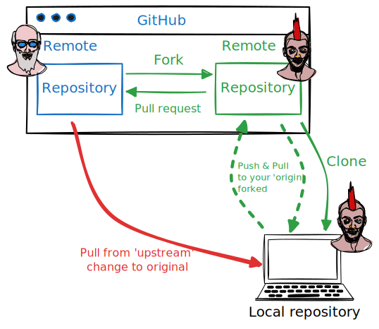

# Forks And Clones

*Bifurcar en gitHub y clonar en local*.

## Bifurcaciones (forks)

Hasta ahora has creado un proyecto local y lo has subido a GitHub, ¡pero esto es sólo la mitad de la diversión! La otra mitad está con otras personas y otros proyectos.

Cuando **bifurcas (fork)** un repositorio, estás creando una copia del mismo en tu cuenta de GitHub. Tu copia bifurcada empieza su vida como un repositorio **remoto** que sólo existe en tu cuente de GitHub, no en tu ordenador. Las bifucaciones (forks) son usadas para crear tu propia versión de un proyecto (esta división es como tomar una bifucación cuando vas por una carretera) o contribuir con tus cambios (como solucionar errores o añadir nuevas funcionalidades) al proyecto original.

Para conseguir una copia de tu bifurcación en GitHub a tu ordenador, tienes que **clonar (clone)** el proyecto. La acción de clonar copia el repositorio remoto en tu ordenador para que puedas trabajar localmente.

Ahora que tienes una copia del repositorio en tu ordenador y está automaticamente conectada a el repositorio remoto (tu copia bifurcada) en tu cuenta de GitHub, escribe `git remote -v` para ver las direcciones que el fork ya tiene configuradas.

### Conectar con el repositorio original

¿Qué pasa si el repositorio original tiene cambios nuevos? Vas a querer tenerlos y **tirar (pull)** de esos cambios.

Puedes ponerle el nombre que quieras a esta conexión remota, pero normalmente la gente usa 'upstream' como nombre.

`git remote add upstream https://github.com/username/repositiry.git`

Para asegurarnos de que tienes correctamente configuradas las conexiones remotas, escribe `git remote -v` para listar las direcciones que tienes guardadas. **Derías tener un remoto con nombre 'origin' con la dirección remota de tu fork y otro con el nombre 'upstream' con la dirección del remoto original.**

Resumen:

+ **Agregar un remoto**
+ `git remote add <NOMBREDELREMOTO> <URL>`
+ **Cambiar la URL a un remoto**
+ `git remote set-url <NOMBREDELREMOTO> <URL>`
+ **Ver las conexiones remotas**
+ `git remote -v`
