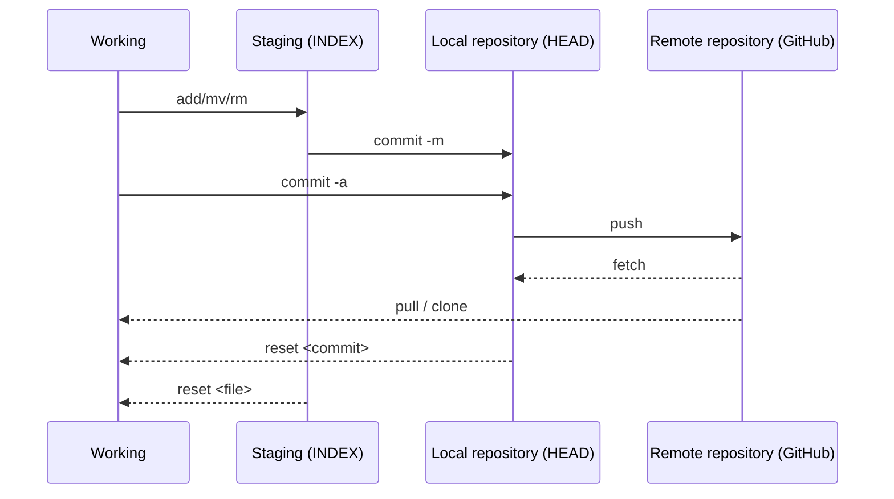

# Comandos Git

### Git y GitHub

    Un breve comentario: git y GitHub ***NO*** son lo mismo. 

    **Git** *es una herramienta* de control de versiones de código abierto creada en 2005 por desarrolladores que trabajan en el sistema operativo Linux. 

    **GitHub** *es una empresa* fundada en 2008 que fabrica herramientas que se integran con git. No necesitas GitHub para usar git, pero no puedes usar GitHub sin usar git. 

>     Existen muchas otras alternativas a GitHub, como GitLab, BitBucket y soluciones de “alojamiento propio” como gogs y gittea. Todos estos se denominan en git-speak "controles remotos" y todos son completamente opcionales. No necesitas usar un control remoto para usar git, pero hará que compartir tu código con otros sea más fácil.
> 
> [An Intro to Git and GitHub for Beginners (Tutorial)](https://product.hubspot.com/blog/git-and-github-tutorial-for-beginners)

### Comandos principales

#### Herramientas de repositorio git

    `git` es una herramienta de línea de comandos de código abierto que se utiliza para gestionar versiones de código fuente en un repositorio Git. Con `git`, puedes realizar una variedad de operaciones, como inicializar un nuevo repositorio, realizar seguimiento de cambios en archivos, crear y fusionar ramas, trabajar con repositorios remotos, entre otras cosas.

     Es una herramienta fundamental para cualquier desarrollador que trabaje con Git y es ampliamente utilizada en la comunidad de desarrollo de software.

* **Ejercicios GitBranching online**: [Learn Git Branching](https://learngitbranching.js.org/?locale=es_ES)
  
  Lo malo que tiene es que guarda los resultados por coockies de sesión. Por lo que se puede perder el progreso si se borran los datos de navegación
  
  Esquema secuencial de acceso al repositorio Git:



**git init**

    Crea o reinicia un repositorio Git existente en uno nuevo en el *working-area*.

**git add**

    Coloca los archivos de trabajo actuales en el escenario *staging-area* (también conocido como índice o caché).

> **git add .** ejecuta lo mismo que **git add --all**
> 
> **git add fichero.txt**

**git remote add origin** (git remote add )

    Agrega el repositorio remoto especificado.

    Estás configurando el repositorio remoto para tu repositorio Git local.

    El comando asocia su repositorio Git local con el repositorio GitHub que creó anteriormente. Esto le permite enviar sus confirmaciones locales al repositorio remoto en GitHub.

> **git remothttps://github.com/user/newurl.gite -v** Lista el fetch y el push origin del remoto vinculado.
> 
>     origin `https://github.com/user/url.git` (fetch)     
> 
>     origin `https://github.com/user/url.git` (push)
> 
> **git remote set-url origin https://github.com/user/newurl.git** Actualiza la url de origen.

**git status**

    Verifica el estado de los cambios en el stage.

**git log**

    Muestra un registro de los commits realizados en un repositorio cronológicamente desde el comit más reciente.

**git ls-remote**

    Enumera todas las referencias en el repositorio remoto, incluidas las sucursales.

**git remote show [remote_name]**

    Muestra información sobre el control remoto especificado, incluidas las sucursales remotas.

**git remote remove origin**

   Se suele ejecutar después de resolver un clone de otro repositorio *ajeno*. Desvincula del remoto descargado

**git commit**

    Confirma cambios por etapas a un *staging-area o *HEAD*

> **git commit -m** *"commit contains message"* permite especificar un mensaje de confirmación en la misma línea de comando. **git commit -a** (abreviado de "all") envía todos los archivos modificados al *staging-area* del local de (abreviatura de "*git add*" y "*git commit*").
> 
> **git commit -am *"commit contains message"*** Git agregará automáticamente todos los archivos modificados al área de preparación y realizará el commit con el mensaje especificado

**git fetch**

    Descarga cambios desde un repositorio remoto al clon local. Sólo recupera los cambios del repositorio remoto pero no los fusiona automáticamente en su sucursal local.

    Esto es útil cuando desea inspeccionar los cambios antes de integrarlos en su rama. Le permite revisar los cambios y decidir cuándo y cómo fusionarlos.

> **git fetch origin**

**git pull**

    Recupera cambios remotos en el clon local y los combina con los archivos de trabajo actuales. Es una combinación de dos operaciones: git fetch seguido de git merge .

    Esto puede ser conveniente para una actualización rápida, pero puede provocar fusiones automáticas, lo que podría generar conflictos que deba resolver.

> **git pull origin main**
> 
> **git pull upstream <branchname>** se trata de un comando utilizado tras <mark>forkear</mark> un repositorio GitHub y puede ser que tras tu último `pull request` el original haya cambiado. Carga esos cambios a tu local.

**git pull request**

    Solicita la revision de lo cambios a fusionar con la rama principal del proyecto. Seguido se debe realizar un merge para realizar la fusión. Esto combinará los cambios de la rama con los cambios existentes en la rama principal (master).

***git pull*** y ***git fetch*** son dos comandos comúnmente utilizados para actualizar el repositorio local con cambios desde un repositorio remoto. Tienen propósitos similares pero funcionan de maneras ligeramente diferentes.

**git merge**

    Fusionar uno o más ramas dentro de la rama que tienes activa. A continuación avanzará la rama actual al resulta do de la fusión. 

    Git combina los cambios de la rama de origen en la rama de destino y *crea un nuevo commit* que representa la fusión de ambos conjuntos de cambios.

    Por lo general, `git merge` se utiliza para integrar cambios entre ramas, como fusionar una rama de desarrollo en una rama principal (por ejemplo, `master` o `main`). Esto permite combinar el trabajo realizado en diferentes ramas en una sola rama, manteniendo un historial de cambios unificado.

**git rebase**

    Se utiliza para reorganizar la historia de un repositorio. En lugar de fusionar ramas, como lo hace `git merge`, `git rebase` vuelve a aplicar cada commit de una rama en la parte superior de otra rama. Esto puede resultar útil para mantener una historia de commits más lineal y limpia.

> **git rebase -i** para realizar un rebase interactivo, lo que te permite reorganizar, editar o combinar commits durante el proceso de rebase.
> 
> Puede que en algún momento debas configurar lo que necesites hacer con rebase y ponerlo a `true` o `false`.
> 
> **git config pull.rebase false** Git realizará un merge (fusión) de los cambios remotos a tu rama local cuando ejecutes `git pull`. Esto significa que Git creará un nuevo commit de fusión que integre los cambios remotos con tu historial de commits local.
> 
> **git config pull.rebase true** Git realizará un rebase de tus cambios locales sobre los cambios remotos al hacer `git pull`. Esto significa que Git intentará aplicar tus commits locales encima de los commits remotos más recientes, reescribiendo la historia de commits local para que parezca que tus cambios se realizaron después de los cambios remotos.
> 
> > En resumen, la diferencia principal entre estas dos configuraciones es cómo se integran los cambios remotos en tu rama local: mediante un merge (`false`) o un rebase (`true`). La elección entre una u otra depende de tus preferencias personales y de las prácticas de trabajo en tu equipo de desarrollo.

**git rm --cached archivo.txt**

    Esto elimina el archivo del área de preparación *staging-area* y lo quita del seguimiento, pero se queda en el sistema de archivos *working-area*.

**git push**

    Carga cambios de las ramas locales a los respectivos repositorios remotos.

> **git push**
> 
> **git push origin master**
> 
> **git push <remotename> --delete <branchname>** eliminar la rama de tu remoto en GitHub.

**git reset**

    Hace que la rama actual apunte a alguna revisión o rama específica.

> **git reset --hard** hace que la rama actual apunte a alguna revisión o rama específica y reemplaza los archivos de trabajo actuales con los archivos de esa rama.

**git branch**

    Tiene varios usos. Muestra la rama donde estoy.

> **git branch** crea una nueva rama o mueve el HEAD (puntero) a otro commit:
> 
> > **git branch -f main HEAD ~ 3** en este ejemplo moveria el puntero a 3 padres atrás.
> > 
> > **git branch -f main C6** en este ejemplo moveria el puntero al commit con hash C6.
> 
> **git branch -M** <newnamebranch> renombra la rama actual en un repositorio. Por ejemplo de `main` a `develop`.
> 
> **git branch -r** lista todas las ramas remotas.
> 
> **git branch -r -v** enumera todas las ramas remotas con el último hash de confirmación y el mensaje de confirmación.
> 
> **git branch -a** muestra todas las ramas locales y remotas.
> 
> **git branch -d** <branchname> elimina la <mark>rama local</mark>, normalmente se utiliza al terminar el *merge*.
> 
> **git push <remotename> --delete <branchname>** eliminar la <mark>rama de tu remoto</mark> en GitHub

**git checkout**

    Reemplaza los archivos de trabajo actuales con archivos de una rama.

> **git checkout --track** crea una rama local a partir de una rama remota, las vincula y reemplaza los archivos de trabajo actuales con archivos de esa rama.

**git revert HEAD**

    El revert se usa en remoto donde otras personas utilizan el mismo repositorio.

**git repo clone**

    Se clonará el repositorio remoto pero si no indico la rama, se clonará la rama master por defecto.

> git repo clone <user/repo>

**git clone --branch**

    Para clonar una rama específica del repositorio remoto.

> git clone --branch <branchname> <remote-repo-url>
> 
> git clone -b <branchname> <remote-repo-url>

    Si quiero asegurarme que se ha clonado la rama correcta, ejecutaré el comando `git branch` sobre el directorio clonado y la consola mostrará mostrar la rama.

> Ejemplo:
> 
> ```
> ~/MyProjects$ git clone --branch development https://github.com/username/reponame.git
>     Clonando en 'reponame'...
>     remote: Enumerating objects: 3, done.
>     remote: Counting objects: 100% (3/3), done.
>     remote: Compressing objects: 100% (2/2), done.
>     remote: Total 3 (delta 0), reused 0 (delta 0), pack-reused 0
>     Recibiendo objetos: 100% (3/3), listo.
> 
> ~/MyProjects$ cd reponame
> 
> ~/MyProjects/reponame$ git branch
> * development    //rama clonada
> ```

#### Tu Identidad

    Lo primero que deberás hacer cuando instales Git es establecer tu nombre de usuario y dirección de correo electrónico. Esto es importante porque los "commits" de Git usan esta información, y es introducida de manera inmutable en los commits que envías.

    De nuevo, sólo necesitas hacer esto una vez si especificas la opción `--global`, ya que Git siempre usará esta información para todo lo que hagas en ese sistema. Si quieres sobrescribir esta información con otro nombre o dirección de correo para proyectos específicos, puedes ejecutar el comando sin la opción `--global` cuando estés en ese proyecto.

> **git config --global user.name** "john"
> 
> **git config --global user.email** "johndoe@unnamed.com"
> 
> **git config --global user.password** token de seguridad.
> 
> **git config --global --unset user.name** Elimina la variable de identidad.
> 
> **git config --global --replace user.name** "newname" Reemplaza la variable de identidad.
> 
> **git config --global --list**: Si quieres comprobar tu configuración, puedes usar el comando `git config --list` para mostrar todas las propiedades que Git ha configurado. Incluida la url del repositorio donde apunta.

**Herramientas de interfaz GitHub CLI (gh)**

    `gh` es la interfaz de línea de comandos oficial de GitHub. GitHub CLI proporciona una forma más fácil de trabajar con GitHub desde la línea de comandos. Permite realizar muchas de las operaciones que normalmente harías a través del sitio web de GitHub, pero desde la terminal.     

    Con `gh`, puedes realizar tareas como crear y clonar repositorios, abrir y revisar solicitudes de extracción (pull requests), crear y revisar problemas (issues), ver información de repositorios y usuarios, entre otras cosas.     

    GitHub CLI es una herramienta útil para aquellos que trabajan en proyectos alojados en GitHub y prefieren realizar tareas desde la línea de comandos en lugar del navegador web.

## Comandos

La estructura de los comandos siguen el mismo patrón `gh <comando> <acción> [flags]` y pueden ser los siguientes:

| Comando | Acciones                                        |
| ------- | ----------------------------------------------- |
| gist    | Ver, crear, editar, eliminar *gists*...         |
| issue   | Ver, crear, reabrir, cerrar *issues*...         |
| pr      | Ver, crear, revisar, cerrar *pull requests*...  |
| release | Crear, eliminar, subir, descargar *releases*... |
| repo    | Crear, clonar, *fork*, y ver repositorios.      |
| alias   | Crea, lista y elimina atajos de comandos.       |
| api     | Hacer llamadas HTTP a Rest o GraphQL API.       |
| auth    | Login, logout, y *refresh* de la autenticación. |
| config  | Maneja la configuración para gh.                |
| help    | El comando de ayuda.                            |

    Autenticación para enlazar nuestro git de trabajo con la cuenta GitHub. Este método utiliza el explorador y dar permisos.

- **gh auth logout** : Salir de la sesión.

- **gh auth refresh** : Actualizar las credenciales.

- **gh auth status** : Verificar el estado de la autenticación.

**gh repo create <reponame> --public**

    Inicia el proceso de creación del repositorio origen.

```
C:\Users\marco\repositorios>gh repo create github-cli
  ? Visibility Private
  ? This will create 'github-cli' in your current directory. Continue? Yes
    ✓ Created repository MarcoMadera/github-cli on GitHub
  ? Create a local project directory for MarcoMadera/github-cli Yes

  Initialized empty Git repository in C:/Users/marco/repositorios/github-cli/.git/
     ✓ Initialized repository in './github-cli/'

C:\Users\marco\repositorios>cd github-cli
C:\Users\marco\repositorios>github-cli>
```

    Para **ver repositorios** utilizamos `gh repo view` seguido del nombre del repositorio de esta forma `usuario/repositorio`. Se puede observar la descripción del repositorio y el contenido del archivo `README.md`.

    Los *flags* que recibe pueden ser por ejemplo `-w` o `--web` para ver el repositorio en la web. Si no incluye un nombre de repositorio se verá el repositorio que está en el directorio actual.