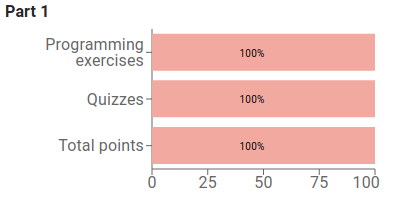
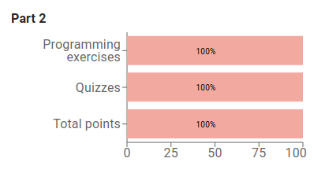
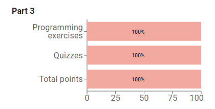
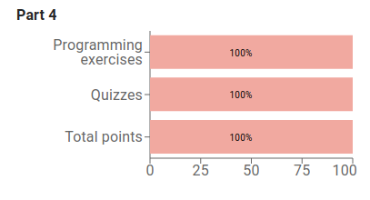
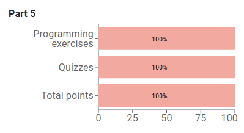
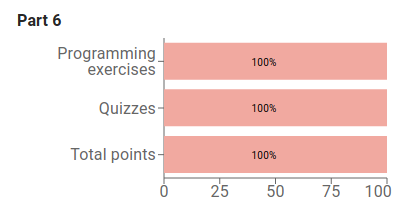

# Index Java Programming exercises.

---

### [Part 1](https://java-programming.mooc.fi/part-1)

[1. Getting started with programming](https://java-programming.mooc.fi/part-1/1-starting-programming)

[2. Printing](https://java-programming.mooc.fi/part-1/2-printing)

[3. Reading input](https://java-programming.mooc.fi/part-1/3-reading)

[4. Variables](https://java-programming.mooc.fi/part-1/4-variables)

[5. Calculating with numbers](https://java-programming.mooc.fi/part-1/5-calculating)

[6. Conditional statements and conditional operation](https://java-programming.mooc.fi/part-1/6-conditional-statements)

[7. Programming in our society](https://java-programming.mooc.fi/part-1/7-programming-in-our-society)

---

### [Part 2](https://java-programming.mooc.fi/part-2)

[1. Recurring problems and patterns to solve them](https://java-programming.mooc.fi/part-2/1-problems-and-patterns)

[2. Repeating functionality](https://java-programming.mooc.fi/part-2/2-repeating)

[3. More loops](https://java-programming.mooc.fi/part-2/3-more-loops)

[4. Methods and dividing the program into smaller parts](https://java-programming.mooc.fi/part-2/4-methods)

[5. End questionnaire](https://java-programming.mooc.fi/part-2/5-end-questionnaire)

---

### [Part 3](https://java-programming.mooc.fi/part-3)

[1. Discovering errors](https://java-programming.mooc.fi/part-3/1-discovering-errors)

[2. Lists](https://java-programming.mooc.fi/part-3/2-lists)

[3. Arrays](https://java-programming.mooc.fi/part-3/3-arrays)

[4. Using strings](https://java-programming.mooc.fi/part-3/4-using-strings)

[5. Summary](https://java-programming.mooc.fi/part-3/5-increasing-amounts-of-data)

---

### [Part 4](https://java-programming.mooc.fi/part-4)

[1. Introduction to object-oriented programming](https://java-programming.mooc.fi/part-4/1-introduction-to-object-oriented-programming)

[2. Objects in a list](https://java-programming.mooc.fi/part-4/2-objects-in-a-list)

[3. Files and reading data](https://java-programming.mooc.fi/part-4/3-files-and-reading-data)

[4. Summary](https://java-programming.mooc.fi/part-4/4-summary)

---

---

### [Part 5](https://java-programming.mooc.fi/part-5)

[1. Learning object-oriented programming](https://java-programming.mooc.fi/part-5/1-learning-object-oriented-programming)

[2. Removing repetitive code (overloading methods and constructors)](https://java-programming.mooc.fi/part-5/2-method-and-constructor-overloading)

[3. Primitive and reference variables](https://java-programming.mooc.fi/part-5/3-primitive-and-reference-variables)

[4. Objects and references](https://java-programming.mooc.fi/part-5/4-objects-and-references)

[5. Conclusion](https://java-programming.mooc.fi/part-5/5-conclusion)

---

---

### [Part 6](https://java-programming.mooc.fi/part-6)

[1. Objects on a list and a list as part of an object](https://java-programming.mooc.fi/part-6/1-objects-within-objects)

[2. Separating the user interface from program logic](https://java-programming.mooc.fi/part-6/2-separating-user-interface-from-program-logic)

[3. Introduction to testing](https://java-programming.mooc.fi/part-6/3-introduction-to-testing)

[4. Complex programs](https://java-programming.mooc.fi/part-6/4-complex-programs)

---

---