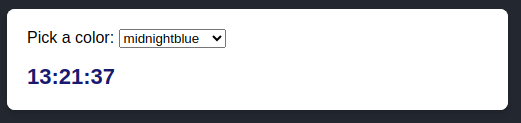

# Pasar accesorios a un componente

**Los props**

    Los componentes de React utilizan *accesorios (props)* para comunicarse entre sí. Cada componente principal puede pasar cierta información a sus componentes secundarios dándoles *props*. Los accesorios *(props)* pueden recordarle los atributos HTML, pero puede pasar cualquier valor de JavaScript a través de ellos, incluidos objetos, matrices y funciones.

## Props familiares

    Los *props* son la información que pasas a una etiqueta JSX. Por ejemplo, `className`, , , y son algunos de los accesorios que puede pasar a `src`:`alt``width``height```.

```javascript
function Avatar() {
  return (
    
  );
}

export default function Profile() {
  return (
    <Avatar />
  );
}
```

## Pasar props a un componente

    En este código, el `Profile`componente no pasa ningún accesorio a su componente secundario `Avatar`:

```javascript
export default function Profile() {
  return (
    <Avatar />
  );
}
```

    Puedes dar `Avatar`algunos accesorios en dos pasos.

### Paso 1: pasar accesorios al componente secundario

    Primero, pásele algunos accesorios `Avatar`. Por ejemplo, pasemos dos accesorios: `person`(un objeto) y `size`(un número):

```javascript
export default function Profile() {
  return (
    <Avatar
      person={{ name: 'Lin Lanying', imageId: '1bX5QH6' }}
      size={100}
    />
  );
}
```

### Paso 2: leer los accesorios dentro del componente secundario

    Puede leer estos accesorios enumerando sus nombres `person, size`separados por comas dentro `({`y `})`directamente después `function Avatar`. Esto le permite usarlos dentro del código `Avatar`, como lo haría con una variable.

    Agregue a `Avatar` algo de lógica que use los accesorios `person`y `size`para renderizar, y listo.

App.js

```javascript
import { getImageUrl } from './utils.js';

function Avatar({ person, size }) {
  // person and size are available here
    return (
        
  );
}
export default function Profile() {
  return (
    <div>
      <Avatar
        size={100}
        person={{ 
          name: 'Katsuko Saruhashi', 
          imageId: 'YfeOqp2'
        }}
      />
      <Avatar
        size={80}
        person={{
          name: 'Aklilu Lemma', 
          imageId: 'OKS67lh'
        }}
      />
      <Avatar
        size={50}
        person={{ 
          name: 'Lin Lanying',
          imageId: '1bX5QH6'
        }}
      />
    </div>
  );
}
```

utils.js

```javascript
export function getImageUrl(person, size = 's') {
  return (
    'https://i.imgur.com/' +
    person.imageId +
    size +
    '.jpg'
  );
}
```

> **No te olvides de colocar `{`y `}`** dentro de `(`y `)` al declarar accesorios:
> 
> ```
> function Avatar({ person, size }) {
>   // ...
> }
> ```
> 
> Esta sintaxis se llama *desestructuración* y equivale a leer propiedades de un parámetro de función:
> 
> ```
> function Avatar(props) {
>   let person = props.person;  
>   let size = props.size;
>   // ...
> }
> ```

## Especificación de un valor predeterminado para un accesorio

    Si desea darle a un accesorio un valor predeterminado al que recurrir cuando no se especifica ningún valor, puede hacerlo con la desestructuración colocando `=` y el valor predeterminado justo después del parámetro:

```javascript
function Avatar({ person, size = 100 }) {
  // ...
}
```

    El valor predetereminado solo se usa si falta el accesorio.

## Reenvío de accesorios con la sintaxis extendida JSX

    Algunos componentes envían todos sus accesorios a sus hijos, como `Profile` ocurre con `Avatar`. Debido a que no usan ninguno de sus accesorios directamente, puede tener sentido usar una sintaxis **spread** más concisa:

```javascript
function Profile(props) {
  return (
    <div className="card">
      <Avatar {...props} />
    </div>
  );
}
```

## Pasando JSX como 'children'

```html
<div>
  
</div>
```

    A veces querrás anidar tus propios componentes de la misma manera:

```javascript
<Card>
  <Avatar />
</Card>
```

    Cuando anida contenido dentro de una etiqueta JSX, el componente principal recibirá ese contenido en un accesorio llamado `children`.

## Cómo cambian los accesorios con el tiempo

    El `Clock`siguiente componente recibe dos accesorios de su componente principal: `color`y `time`.

```javascript
export default function Clock({ color, time }) {
  return (
    <h1 style={{ color: color }}>
      {time}
    </h1>
  );
}
```



    Aquí, el prop `time` cambia cada segundo y `color` cambia cuando seleccionas otro color. Los accesorios reflejan los datos de un componente en cualquier momento, en lugar de solo al principio.

    Sin embargo, los props son *inmutables*. Cuando un componente necesita cambiar sus accesorios (por ejemplo, en respuesta a una interacción del usuario o a nuevos datos), tendrá que “pedirle” a su componente principal que le pase *diferentes accesorios*. Sus viejos props se dejarán de lado y finalmente, el motor JavaScript recuperará la memoria que tomaron.

    **No intentes “cambiar props”.** Cuando necesite responder a la entrada del usuario (como cambiar el color seleccionado), necesitará "establecer el estado". **Estado: Memoria de un componente**.

## Resumen

* Para pasar accesorios, agréguelos al JSX, tal como lo haría con los atributos HTML.
* Para leer accesorios, utilice la sintaxis desestructurante `function Avatar({ person, size })`.
* Puede especificar un valor predeterminado como `size = 100`, que se utiliza para elementos faltantes y `undefined`.
* Puedes reenviar todos los accesorios con `<Avatar {...props} />`la sintaxis extendida JSX, ¡pero no la uses en exceso!
* El tipo JSX anidado `<Card><Avatar /></Card>`aparecerá como prop `children` del componente `Card`.
* Los accesorios son instantáneas de solo lectura en el tiempo: cada renderizado recibe una nueva versión de los props.
* No puedes cambiar los props. Cuando necesite interactividad, deberá establecer el estado.