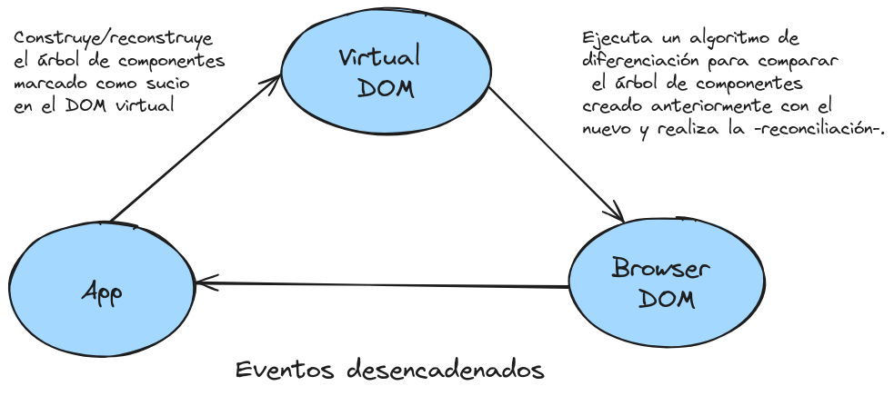

# Renderizar el DOM virtual

    El DOM virtual `VDOM`es un concepto de programación en el que una representación ideal o `virtual` de una interfaz de usuario se mantiene en la memoria y se sincroniza con el DOM real por una biblioteca como *react-dom* y es una representación ligera en memoria del DOM real. 

> Este proceso se conoce como [reconciliación](https://legacy.reactjs.org/docs/reconciliation.html).

    El `Reconciler`examina las diferencias entre las representaciones DOM virtuales anteriores y nuevas y calcula el conjunto mínimo de cambios necesarios.

    En lugar de manipular el DOM del navegador directamente, React crea un DOM virtual en la memoria, donde realiza todas las manipulaciones necesarias antes de realizar los cambios en el archivo real DOM del navegador. Esto abstrae la manipulación de atributos, el manejo de eventos y la actualización manual de DOM, que de otro modo tendría que usar para crear su aplicación.

>     *El DOM virtual `VDOM`es una representación ligera en memoria del DOM real, con una estructura en forma de árbol y una jerarquía de objetos de nodo que corresponde a la estructura del DOM.* 

    Durante el proceso de algoritmo `diffing`, React compara los dos árboles `VDOM`, **nodo por nodo** , y determina qué nodos han cambiado, agregado o eliminado. Luego, una vez identificados los cambios necesarios, `Reconciler`los aplica al DOM real, actualizando selectivamente solo los elementos afectados.

    Esto garantiza que el **DOM del navegador real refleje con precisión el estado del nuevo componente** . Luego, el contenido actualizado se muestra en la pantalla. Al utilizar este enfoque, React optimiza el rendimiento minimizando las interacciones directas con el DOM del navegador y actualizando solo las partes necesarias.