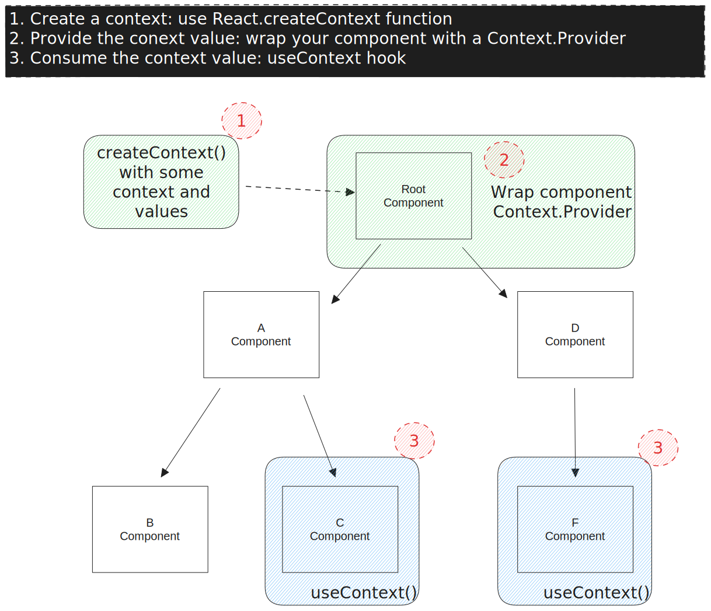

# Hook useContext

> `const value = useContext(SomeContext)`
> 
>     Permite **consumir valores de contexto de un antepasado más cercano** `Context.Provider`. 

A continuación se ofrece una breve descripción general de los tres pasos a utilizar `useContext`:

1. **Crear un contexto** : para usar `useContext`, **primero debe crear un contexto** usando la función `React.createContext`. Esta función toma un valor predeterminado para el contexto, que se usará si `Context.Provider` no está presente en el árbol de componentes.
2. **Proporcione el valor de contexto** : para que el valor de contexto esté disponible para sus componentes, debe envolver su árbol de componentes con un `Context.Provider`componente y pasar el valor de contexto como un accesorio.
3. **Consumir el valor de contexto** : para consumir el valor de contexto en un componente, puede usar el enlace `useContext` y pasar el objeto de contexto como argumento. El *hook* devolverá el valor de contexto actual, que luego podrá usar en su componente.
   
   
   
   

