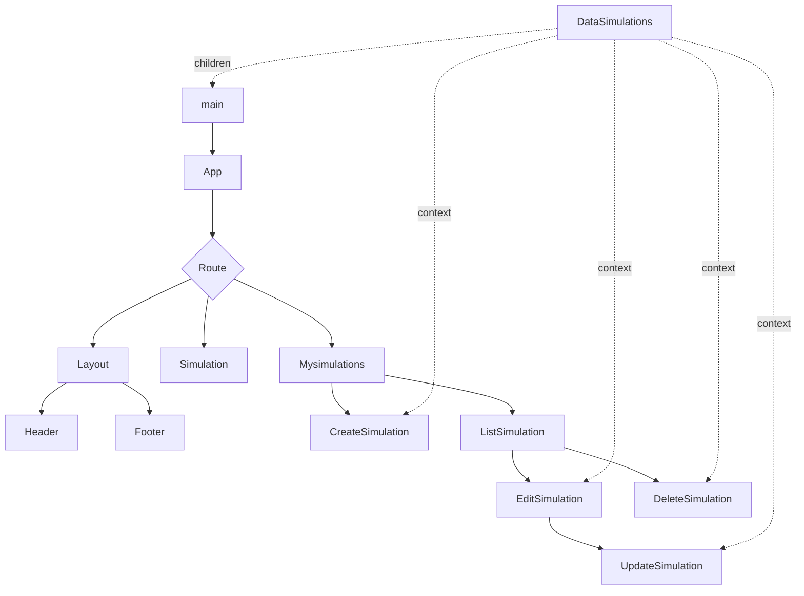

# Traffic lights V5

## Decoupling `MySimulations.jsx` CRUD

    Decoupled components CRUD in React promotes modularity, reusability, maintainability, and scalability, making it a preferred choice for building robust and adaptable applications.

**mysimulations folder**

- CreateSimulation.jsx

- DeleteSimulation.jsx

- EditSimulation.jsx

- ListSimulation.jsx

- MySimulations.jsx

- UpdateSimulation.jsx

    Each component focuses on a specific task, promoting **separation of concerns and simplifying maintenance**. With decoupled components, testing becomes more straightforward as each unit can be isolated and tested independently.

