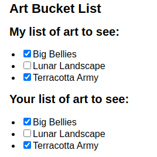

# Actualización de matrices en estado

    Al almacenar matrices `en estado` deberán considerarse como inmutables y se tratarán como los objetos almacenados `en estado` (para actualizar, necesitaré crear una nueva o copiar la existente) para luego configurar el estado y usar el nuevo. Lo que significa que son de **solo lectura**.

    Por lo que no se debe reasignar elementros dentro de una matriz como `arr[0] = 'pajaro'` y tampoco usar métodos que muten la matriz, como `push()` y `pop()`.

    Para actualizar una matriz deberá pasar una nueva matriz a su función de configuración de estado. Para hacer eso, puede crear una nueva matriz a partir de la matriz original en su estado llamando a sus **métodos no mutantes** como `filter()`y `map()`.

    Cuando trabaje con matrices dentro del estado React, deberá evitar los métodos de la columna de la izquierda y, en su lugar, preferir los métodos de la columna de la derecha:

|               | <mark>EVITAR</mark>(muta la matriz) | <mark>PREFERIR</mark> (devuelve una nueva matriz)                                                                        |
| ------------- | ----------------------------------- | ------------------------------------------------------------------------------------------------------------------------ |
| añadiendo     | `push`,`unshift`                    | `concat`, `[...arr]`difundir sintaxis ( [ejemplo](https://react.dev/learn/updating-arrays-in-state#adding-to-an-array) ) |
| eliminando    | `pop`, `shift`,`splice`             | `filter`, `slice`( [ejemplo](https://react.dev/learn/updating-arrays-in-state#removing-from-an-array) )                  |
| reemplazando  | `splice`, `arr[i] = ...`asignación  | `map`( [ejemplo](https://react.dev/learn/updating-arrays-in-state#replacing-items-in-an-array) )                         |
| clasificación | `reverse`,`sort`                    | copie la matriz primero ( [ejemplo](https://react.dev/learn/updating-arrays-in-state#making-other-changes-to-an-array) ) |

    Alternativamente, puedes usar Immer, que te permite usar métodos de ambas columnas.

> Nota:
> 
> - `slice` permite copiar una matriz o una parte de ella.
> 
> - `splice` **muta** la matriz (para insertar o eliminar elementos).
> 
> > En React, usarás **slice** con mucha más frecuencia porque no quieres mutar objetos o matrices en el estado. Actualizar objetos explica qué es la mutación y por qué no se recomienda para el estado.

### Agregar a una matriz

    La manera mas sencilla de añadir, es utilizar la sintaxis del opreador **spread** ( `...` ) 

```javascript
//example 1
setArtists(             // Replace the state
  [                     // with a new array
    ...artists,                     // that contains all the old items
    { id: nextId++, name: name }     // and one new item at the end
  ]
);
//example 2
setArtists([
  { id: nextId++, name: name },
  ...artists // Put old items at the end
]);
```

    De esta manera, el *spread* puede hacer el trabajo de `push()`agregar al final de una matriz y `unshift()`al principio de una matriz.

### Eliminar de una matriz

    La forma más sencilla de eliminar un elemento de una matriz es *filtrarlo* . En otras palabras, producirá una nueva matriz que no contendrá ese elemento. Para hacer esto, use el `filter`.

    A suponer que existe un listado de artistas con `id`'s únicos y cada uno tiene un botón de "Eliminar" a un lado:

```javascript
<button onClick={() => {
    setArtists(
        artists.filter(a =>
            a.id !== artist.id
        )
    );
}}>Delete
</button>
```

    Al presionar el botón, `a.id !== artist.id` "crea" una nueva matriz de artistas cuyos `id` son diferentes. En otras palabras, el botón "Eliminar" de cada artista filtrará *a ese* artista fuera de la matriz y luego solicitará una nueva renderización con la matriz resultante. Tenga en cuenta que `filter`no modifica la matriz original.

### Transformando una matriz

    Si desea cambiar algunos o todos los elementos de la matriz, puede utilizar `map()`para crear una **nueva** matriz. La función a la que pasarás `map`puede decidir qué hacer con cada elemento, en función de sus datos o su índice (o ambos).

>     Ejemplo: 
> 
>     Una matriz que contiene las coordenadas de dos círculos y un cuadrado. Cuando presionas el botón, mueve solo los círculos hacia abajo 50 píxeles. Para ello, produce una nueva matriz de datos utilizando `map()`:
> 
>     [Ejemplo de circulos en Sandbox.io](https://codesandbox.io/p/sandbox/react-dev-23jffr?file=%2Fsrc%2FApp.js&utm_medium=sandpack)

### Reemplazo de elementos en una matriz

    Para reemplazar un elemento, cree una nueva matriz con `map`. Dentro de su llamada a `map`, recibirá el índice del elemento como segundo argumento.

```javascript
import { useState } from 'react';

let initialCounters = [
  0, 0, 0
];

export default function CounterList() {
  const [counters, setCounters] = useState(initialCounters);

  function handleIncrementClick(index) {
    const nextCounters = counters.map((c, i) => {
      if (i === index) {
        // Increment the clicked counter
        return c + 1;
      } else {
        // The rest haven't changed
        return c;
      }
    });
    setCounters(nextCounters);
  }

  return (
    <ul>
      {counters.map((counter, i) => (
        <li key={i}>
          {counter}
          <button onClick={() => {
            handleIncrementClick(i);
          }}>+1</button>
        </li>
      ))}
    </ul>
  );
}
```

### Insertar en una matriz

    Es posible insertar un elemnto en una posición particular que no esté ni al princio ni al final. Para hacer esto, se puede usa el operador `spread` con el métod `slice()`, que permirte cortar una porción de la matriz.

```javascript
function handleClick() {
    const insertAt = 1; // Could be any index
    const nextArtists = [
      // Items before the insertion point:
      ...artists.slice(0, insertAt),
      // New item:
      { id: nextId++, name: name },
      // Items after the insertion point:
      ...artists.slice(insertAt)
    ];
    setArtists(nextArtists);
    setName('');
  }

  return ( 
    <>
        ...    //etc
    </> )
```

## Realizar otros cambios en una matriz

    Es posible que desee invertir u ordenar una matriz. JavaScript `reverse()`y `sort()`los métodos están mutando la matriz original, por lo que no puedes usarlos directamente.

    Sin embargo, puede copiar la matriz primero y luego realizar cambios en ella.

```javascript
function handleClick() {
    const nextList = [...list];
    nextList.reverse();
    setList(nextList);
  }
```

    La funciones JavaScript `reverse()` y `sort()` son métodos que mutan la matriz original, por lo que se debe copiar la matriz `[...list]` para realizar cambios en ella, por ejemplo el `nextList.reverse();` y setear la nueva.

### Actualizar objetos dentro de matrices

    *Los objetos en realidad* no están ubicados "dentro" de las matrices. Puede parecer que están "dentro" del código, pero cada objeto de una matriz es un valor independiente, al que la matriz "apunta". El problema de actualizar el elemento por índice de una copia esque también se actualiza el nombre del elemento antiguo pues ambos comparten esa id.

```javascript
const myNextList = [...myList];
const artwork = myNextList.find(a => a.id === artworkId);
artwork.seen = nextSeen; // Problem: mutates an existing item
setMyList(myNextList);    
```

    Por ejemplo, al marcar un check puede marcarse el de las dos listas, la origian y la copia:



    Aunque la `myNextList`matriz en sí es nueva, los *elementos en sí* son los mismos que en la `myList`matriz original. Entonces, cambiar `artwork.seen`cambia el elemento de arte *original* . Ese elemento de arte también está en `yourList`, lo que causa el error. Es devido al estado mutante. Se puede evitar utilizando `map`

```javascript
setMyList(myList.map(artwork => {
  if (artwork.id === artworkId) {
    // Create a *new* object with changes
    return { ...artwork, seen: nextSeen };
  } else {
    // No changes
    return artwork;
  }
}));
```

>  **El cambio se realiza en el momento de hacer la copia en vivo.**
> 
> En general, **sólo debes mutar objetos que acabas de crear.** Si estuvieras insertando una *nueva* obra de arte, podrías mutarla, pero si estás tratando con algo que ya está en estado, necesitas hacer una copia.

### Lógica de actualización con Immer

    Si no se desea cambiar su estructura de estado, es posible que prefiera usar **Immer** , que le permite escribir usando la sintaxis conveniente pero cambiante y se encarga de producir las copias por nosotros.

```javascript
updateMyTodos(draft => {
  const artwork = draft.find(a => a.id === artworkId);
  artwork.seen = nextSeen;
});
```

    Esto se debe a que no está mutando el estado *original* , sino que está mutando un `draft`objeto especial proporcionado por Immer. De manera similar, puede aplicar métodos de mutación como `push()`y `pop()`al contenido del archivo `draft`.

    **Immer** siempre construye el siguiente estado desde cero de acuerdo con los cambios que ha realizado en el archivo `draft`.

## Resumen

* Puedes poner matrices en estado, pero no puedes cambiarlas.
* En lugar de mutar una matriz, cree una *nueva* versión y actualice su estado.
* Puede utilizar el operador spread `[...arr, newItem]` para crear matrices con elementos nuevos.
* Puede utilizar `filter()`y `map()`para crear nuevas matrices con elementos filtrados o transformados.
* Puede utilizar Immer para mantener su código conciso.

---