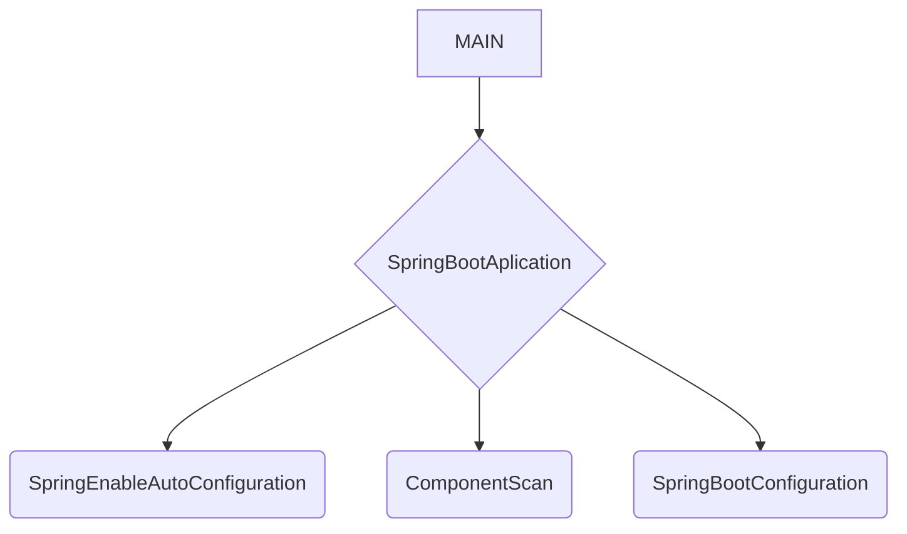
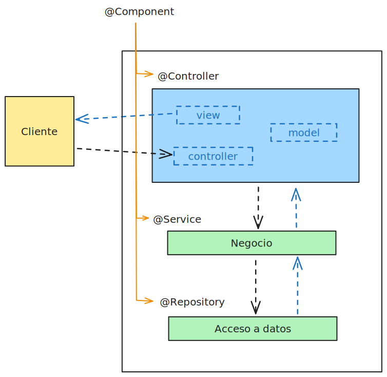

# Conceptos Spring MVC.

## Dependencias y esteriotipos



**MAIN**

`@SpringBottApplication` 

+ `@EnableAutoConfiguration` 

+ `@ComponentScan` 

+ `@SpringBootConfiguration`

---

### Dependencias

POM.XML -> maven

+ **spring-boot-starter-parent** : Define valores predeterminados como la versión de Java y complementos de Maven para el desarrollo de Java Spring.

+ spring-boot-devtools

+ spring-boot-starter-thymeleaf

+ **spring-boot-dependencies** : Es la infomación de dependencias para Spring Boot, Spring Framework y bibliotecas comunes.

+ **spring-boot-maven-plugin** : Permite la creación del archivo **JAR** para ejecutar la aplicación web Java. Es independiente del servidor Tomcat.

+ **spring-boot-starter-web** : Es el Spring Boot Starter que especifica el grupo de dependencias para desarrollar Java, Spring Web MVC y el servidor Tomcat. extrae las bibliotecas de uso común para el desarrollo de aplicaciones Spring MVC; spring-webmvc, jackson.json, validation-api y tomcat.

+ **spring-boot-starter-data-jpa** incluye las dependencias necesarias para usar Spring Data JPA con las bibliotecas de <mark>Hibernate</mark> como implementación de JPA.

### Características de Spring MVC

    **Spring MVC** es un framework construido sobre Java Servlet y mejora el desarrollo de aplicaciones web que se ejecutan en contenedores de servlets como Apache Tomcat y es parte de **Spring Framework Core**.

    Se puede usar para derrollo web para el modelo `solicitud/respuesta síncrono y asíncrono`, servicios `RESTful` y `API REST`.

+ Patrones de diseño **Dispatcher Servlet** (controlador frontal) y **Model View Controller**.

+ Asignaciones de controladores y controladores anotados

+ Manejo y validación de formularios

+ Integración con Spring Security, Servlet Async API y tecnologías de visualización como Thymeleaf, FreeMarker, JSP, STL, PDF, Excel, etc.

### Concepto de estereotipos

    Un estereotipo extiende de @Component. Un @Repository es un estereotipo de @Component, que es usado dentro del marco Spring.

+ `@Component` : Es el padre, del que heredan `service`, `@Repository` y  `@Controller`, llamados elementos de estereotipo.

+ `@Repository` : Es el estereotipo que se encarga de dar alta un bean para que implemente el patrón repositorio. Al marcar el bean con esa anotación, Sprinng aporta servicio de conversión de JDBC a JPA.

+ `@Controller` : Es el estereotipo que recibe las peticiones del cliente que realiza las tareas de control y gestión de la comunicación entre el usuario y el aplicativo. Se ubica entre el `View` y el `@Service`.

+ Un bean es un componente o elemento de Spring, fabricado en el core o contexto del contenedor Spring.



+ `@Autowired` : Permite inyectar dependencias con otras dentro del marco de Spring. Desde *Controller* se utiliza un servicio mediante *Autowired* y desde *Service* se utiliza un repositorio mediante el *Autowired*.


```java
@Service
public class PersonaServiceImpl implements PersonaService{
    @Autowired
    private PersonaRepository personaRepository;
    @Override
    public List<Persona> obtenerTodas() {
        return personaRepository.findAll();
    }
    @Override
    public Persona obtenerPorId(Long id) {
        return personaRepository.findById(id).orElse(null);
    }
    @Override
    public Persona crearPersona(Persona persona) {
        return personaRepository.save(persona);
    }
```

> Desde el *Servicio* se utiliza un interface de *Repositorio* para utilizar sus métodos  y gestionar el *Modelo* "Persona".

## Métodos HTTP en Spring MVC

    Funciones o procedimientos definidos en los controladores que manejan las solicitudes HTTP y coordinan la lógica de negocio del aplicativo.

`@RequestMapping` : Indica que tipo de método se utilizará e indica el endpoint al controller *("/mostrarMensage")* .

| Anotación        | Operación | SQL    | HTTP   |
| ---------------- | --------- | ------ | ------ |
| `@GetMapping`    | Read      | SELECT | GET    |
| `@PostMapping`   | Create    | INSERT | POST   |
| `@PutMapping`    | Update    | UPDATE | PUT    |
| `@DeleteMapping` | Delete    | DELETE | DELETE |

## Inyección de dependencias

    Es un patrón de software que describe el conjunto de técnicas destinadas a disminuir el acoplamiento entre los componentes y es uno de los principios SOLID.

## Técnica de programación ORM

    **Object-Relational Mapping** es utilizada para el desarrollo de aplicaciones para mapear objetos de lenguaje de progrmación orientada a objetos a tablas de bases de datos relacionales, que se interactuan utilizando objetos y métodos en lugar de escribiendo consultas. 

    Interviene entre una clase y una tabla relacional. Por ejemplo, guardando un `Student class` con su id, nombre, apellido, contacto. **Hibernate** es muy utilizado.


Algunas herramientas que ofrecen **implementaciones** de ORM :

+ Hibernate

+ EclipseLink

+ Spring Data JPA

+ MyBatis

+ TopLink

+ Active JDBC

+ Query DSL

+ Cayenne

## Especificación JPA

**Java Persistence API** Es desarrolla para la plataforma Java EE.

    Las *especificaciones* de JPA permiten definir entidades, clases, relaciones y en definitiva el comportamiento :

+ Define entidades.

+ Definde relaciones.

+ Define el comportamiento.

> JPA es una especificación y ORM es la implementación. La entidad `Student` está especificado por JPA y ORM implementa hacia la base de datos. Hibernate es la herramienta para llevar todos los datos a la table.

## Hibernate

    Es la herramienta de mapeo objeto-relacionel (ORM), para plataforma Java - también disponible para .Net con el nombre NHibeanate - que facilita el mapeo de atributos entre una base de datos relacional tradicional y el model de objetos de una aplicación; mediante archivos declarativos (XML) o anotaciones (@) en los *beans* de las entidades que lo permitan.

+ Clases

+ Interfaces

+ Anotaciones

+ XML

---

> **ORM** -> Mapeo relacional de objetos, una técnica de programación para convertir datos entre sistemas de tipos incompatibles en lenguajes de programación orientados a objetos y bases de datos relacionales.
> 
> **DAO** -> Objeto de acceso a datos, un patrón de diseño que proporciona una interfaz abstracta para acceder a datos desde una base de datos u otro mecanismo de almacenamiento persistente.
> 
> **APP** -> Java Persistence API, una especificación para el mapeo relacional de objetos en Java que proporciona una forma estándar de mapear objetos Java a bases de datos relacionales.

---

## Spring Data JPA

    Es un starter dentro del ecosistema de proyectos *Spring* que simplifica el acceso a bases de datos y la persistencia en general. No es una implementación de JPA; es una capa de abstracción adicional que trabaja junto a *JPA* y otras tecnologías de <u>persistencia</u>.

    Spring Data propociona repositorios *CRUD* predefinidos y soporte para tecnologías de almacenamiento como JPA, MongoDB y Redis

> Spring Data JPA es un proyecto dentro de Spring Data que se centra en facilitar el uso de **JPA**.

## Thymeleaf

    Es un motor de plantillas Java del **lado del servidor** que proporciona un *fontend* en el *backend* para entornos web e independientes. Es una tecnología que permite obtener un documento con un **modelo (*Model*)** de datos, por lo que permite que HTML se muestre correctamente en navegadores y como prototipos estáticos.

| JavaEE   | SpringBoot |
|:--------:|:----------:|
| TagLib   | HTML5      |
| Scriplet | Plantillas |
| JSP      | Thymeleaf  |

### Tipos de expresiones

+ Expresiones variables : `${ ... }`

+ Expresiones de selección : `*{ ... }`

+ Expresiones de mensaje : `#{ ... }`

+ Expresiones de enlace : `@{ ... }`

+ Expresiones de fragmentos : `~{ ... }`
