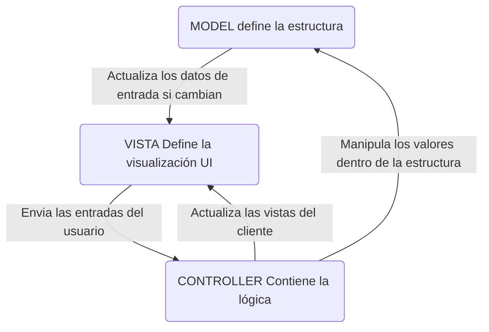

# Conceptos básicos de Spring Boot

    Spring Boot es un marco para crear aplicaciones basadas en *Spring Framework*. Su objetivo es simplificar el proceso de desarrollo proporcionando un conjunto de opciones y valores predeterminados preconfigurados, así como un conjunto de herramientas para crear y ejecutar rápidamente una aplicación. Algunos conceptos clave de Spring Boot incluyen:

* **Configuración automática** : Configura automáticamente su aplicación en función de las dependencias que haya agregado, eliminando la necesidad de configuración manual.
* **Iniciadores** : Spring Boot proporciona un conjunto de "iniciadores" que son dependencias preconfiguradas para funciones comunes, como desarrollo web, acceso a datos y seguridad.
* **Actuador** : Incluye un "Actuador" que proporciona puntos finales (*endpoints*) para monitorear y administrar su aplicación, como controles de estado, métricas e información de seguimiento.
* **Interfaz de línea de comandos** : Spring Boot proporciona una interfaz de línea de comandos (CLI) para crear y ejecutar aplicaciones rápidamente.
* **Spring Initializer** : Spring Initializer es un servicio web que proporciona una forma sencilla de generar una estructura básica para una aplicación Spring Boot.

    Todos estos conceptos están diseñados para facilitar la creación y ejecución de una aplicación basada en Spring, con una configuración mínima requerida.

## Fundamentos

    Algunos de los conceptos clave de Spring Boot y su funcionamiento incluyen:

* **Beans** : en Spring, un bean es un objeto Java administrado por el contenedor Spring. Los beans generalmente se definen en archivos de configuración y el contenedor Spring es responsable de crear instancias, configurar y administrar el ciclo de vida de estos beans.
* **Inyección de dependencia** : Spring utiliza la inyección de dependencia para gestionar las dependencias entre beans. Esto significa que en lugar de crear instancias y configurar dependencias manualmente, puede usar anotaciones o archivos de configuración para indicarle al contenedor Spring qué dependencias tiene un bean y cómo se deben crear instancias.
* **Programación orientada a objetos** : Spring se basa en principios de programación orientada a objetos y utiliza interfaces y herencia para crear una base de código modular y reutilizable.
* **Programación orientada a aspectos** : Spring también brinda soporte para la programación orientada a aspectos (*AOP*), que le permite separar preocupaciones transversales como el *registro, la seguridad y la gestión de transacciones de la lógica* empresarial central de su aplicación.
* **Acceso a datos** : Spring Boot proporciona un conjunto de iniciadores y bibliotecas para conectarse a bases de datos y realizar operaciones de acceso a datos. También proporciona soporte para marcos de mapeo relacional de objetos (*ORM*) como Hibernate y *JPA*.
* **Desarrollo web** : Spring Boot proporciona un conjunto de iniciadores y bibliotecas para crear aplicaciones web y servicios web *RESTful*. También proporciona soporte para tecnologías web como *Spring MVC y Thymeleaf*.
* **Anotaciones** : Spring Boot utiliza ampliamente anotaciones para configurar beans y administrar dependencias. Comprender las diferentes anotaciones disponibles en Spring, como `@Bean`, `@Autowired`y `@Component`, puede ayudarle a utilizar el marco de forma eficaz.
* **MVC (Modelo-Vista-Controlador)** : Spring Boot proporciona soporte para el patrón arquitectónico MVC, que separa la aplicación en tres capas: el modelo (datos), la vista (presentación) y el controlador (lógica). Comprender cómo funciona MVC en Spring Boot puede ayudarlo a estructurar su aplicación de manera efectiva. Separa la lógica de la aplicación en tres componentes: **Modelo-Vista-Controlador**.
* **REST (Transferencia de estado representacional)** : Spring Boot brinda soporte para crear servicios web RESTful. Comprender los principios de REST y cómo crear servicios web RESTful utilizando Spring Boot puede ayudarle a utilizar el marco de forma eficaz.

    En general, Spring Boot funciona proporcionando un conjunto de opciones y valores predeterminados preconfigurados, así como un conjunto de herramientas para crear y ejecutar rápidamente una aplicación utilizando Spring Framework.

    Utiliza conceptos como beans, inyección de dependencia y programación orientada a objetos para facilitar la creación y ejecución de una aplicación basada en Spring, con una configuración mínima requerida.

## Modelo - `model`

    Representa los datos y la lógica empresarial de la aplicación. Gestiona el estado de la aplicación y la comunicación con otros componentes, como la base de datos o servicios externos.

*Ciclo de solicitud-respuesta de Spring Boot*


> [Diagrama con Miro](https://miro.com/)

    En Spring Boot se llama *modelo* a una clase Java. Define la estructura de los datos que se pasarán entre las diferentes capas de la aplicación y se suelen anotar como @Entiry o @Data como estereotipo del modelo de datos.

```java
@Data
@Entity
@NoArgsConstructor
@AllArgsConstructor
@Table(name= "tbl_personas")
public class Product {
    @Id
    @GeneratedValue(strategy = GenerationType.IDENTITY)
    private Long id;
    private String name;
    private String description;
    private double price;
}
```

    El modelo define qué datos debe contener la aplicación. Si el estado de estos datos cambia, entonces el modelo generalmente notificará a la vista (para que la pantalla pueda cambiar según sea necesario) y, a veces, al controlador (si se necesita una lógica diferente para controlar la vista actualizada).

    Volviendo a nuestra aplicación de listados, el modelo especificaría qué datos deben contener los elementos de la lista (artículo, descripción, precio, etc.) y qué elementos de la lista ya están presentes.

*Flujo del Modelo Vista Controlador*



> [Mermaid Diagram & Charting tool](https://mermaid.js.org/)

## Spring Boot JPA e [I]njección de [D]ependencias

### JPA - Java Persistence API

    És una <mark>especificación</mark> de Java para gestionar, conservar y acceder a datos relacionales (en una base de datos) en aplicaciones Java y una API estándar para **ORM (tecnología de Mapeo relacional de objetos)** y proporciona una forma de asignar objetos Java a bases de datos relacionales.

    En resumido, JPA se utiliza para interactuar con bases de datos, que proporciona una forma cómoda y potente de realizar operaciones *CRUD* con funciones útiles como almacenamiento en caché, carga diferida y gestión automática de transiciones.

*Ciclo de solicitud-respuesta de Spring Boot*


> Datos de interés y guía
> 
> + [JPA de datos de primavera](https://spring.io/projects/spring-data-jpa)
> + [Accediendo a datos con JPA](https://spring.io/guides/gs/accessing-data-jpa/)

La dependencia de *data-jpa* para el repositorio Maven tiene la siguiente pinta:

```java
<dependency>
    <groupId>org.springframework.data</groupId>
    <artifactId>spring-data-jpa</artifactId>
    <version>3.0.4</version>
</dependency>
```

    Cuando se usa `JPA` en Spring Boot, puede usar la anotación @Entity para definir una clase como una entidad `JPA` y la anotación @Repository para definir una clase del repositorio `JPA`. Esto le permite utilizar el repositorio `JPA` y realizar operaciones CRUD en la tabla de base de datos correspondiente.

### Características:

+ Soporte sofisticado para construir repositorios basados ​​en Spring y JPA.
+ Soporte para predicados de Querydsl y, por lo tanto, consultas de tipado seguro de JPA.
+ Auditoría transparente de la clase de dominio.
+ Soporte de paginación, ejecución dinámica de consultas, capacidad de integrar código de acceso a datos personalizado.
+ Validación de consultas anotadas `@Query` en el momento del arranque.
+ Soporte para mapeo de entidades basado en XML
+ Configuración del repositorio basada en JavaConfig introduciendo `@EnableJpaRepositories`.

## Repositorios de Spring Data

    `Spring Data Repositories` proporciona una abstracción genérica de alto nivel para el acceso a datos que permite a los desarrolladores trabajar con datos de diversas fuentes de datos, incluidas bases de datos relacionales, bases de datos NoSQL y otros almacenes de datos, utilizando una API consistente y simplificada.

```java
import org.springframework.data.repository.CrudRepository;
import java.util.Optional;
//@Repository
public interface BookRepository extends CrudRepository <Book, Long> {
    // custom query methods defined here
    Optional<Book> findBookByTitle(String title);
    Optional<Book> deleteBookByTitle(String title);
}
```

    Los repositorios eliminan la necesidad de código repetitivo y permiten a los desarrolladores definir métodos de consulta y consultas dinámicas de una manera sencilla.

    **Spring Data Repositories** también brinda soporte para paginación, clasificación y auditoría, así como integración con otras tecnologías Spring, como **Spring MVC y Spring Security**.

Spring Data Repositories **simplifica** el acceso a los datos y permite el rápido desarrollo de aplicaciones basadas en datos.

## 3 Usando la interfaz [CrudRepository](https://docs.spring.io/spring-data/commons/docs/current/api/org/springframework/data/repository/CrudRepository.html)

    `CrudRepository` es una interfaz proporcionada por Spring Data que define un conjunto estándar de métodos para realizar operaciones *CRUD (Crear, Leer, Actualizar y Eliminar)* en entidades. *La interfaz* proporciona una funcionalidad básica de acceso a datos y se puede ampliar para proporcionar funcionalidad adicional según sea necesario.

En el ejemplo - repositorio de libros:

```java
import org.springframework.data.repository.CrudRepository;
import java.util.Optional;
//@Repository
public interface BookRepository extends CrudRepository <Book, Long> {
    // custom query methods defined here
    Optional<Book> findBookByTitle(String title);
    Optional<Book> deleteBookByTitle(String title);
}
```

    Usamos `@Autowired` para inyectar una instancia de `BookRepository`en nuestra aplicación Spring, el contenedor de inyección de dependencias de Spring creará automáticamente una instancia de una implementación concreta de la interfaz `BookRepository` y la inyectará en el objeto de nuestra aplicación `bookRepository`. Esta implementación suele ser un **objeto proxy** que proporciona la funcionalidad necesaria para el acceso a datos.

Servicio de libros:

```java
import java.util.Optional;
import org.springframework.beans.factory.annotation.Autowired;
import org.springframework.stereotype.Service;

@Service
public class BookService {

    @Autowired
    BookRepository bookRepository;

    public Iterable<Book> getAllBooks() {
        return bookRepository.findAll();
    }
```

Con este objeto, podemos usar los métodos definidos en la interfaz `CrudRepository` como `save()`, `findOne()`, `findAll()`y `delete()`, para realizar operaciones CRUD en entidades de Libro.

## DIP - Principio de Inversión de Dependencia

    Es un principio de diseño de software que establece que los módulos de alto nivel no deben depender de los módulos de bajo nivel, sino que ambos deben depender de abstracciones.

    La anotación `@Repository` sigue este principio al permitir que la capa *DAO* dependa de una interfaz ( por medio de la abstracción) en lugar de depender directamente de una implementación concreta. Esto permite un mantenimiento, pruebas y flexibilidad más fáciles para cambiar la implementación de la capa *DAO*.

### DI - Inyección de Dependencia y repositorio

    Es un patrón de diseño que implementa *DIP* inyectando dependencias (objetos o interfaces) en una clase en tiempo de ejecución.

    En el caso de la anotación `@Repository`, la dependencia es el objeto *EntityManager*, que se inyecta en la clase *DAO* mediante la anotación `@PersistenceContext`. Esto permite desacoplarlo de la implementación de *EntityManager* y proporciona flexibilidad para usar diferentes implementaciones de *EntityManager*.

> Recursos : [Dependency Inversion Principle](https://www.tutorialsteacher.com/ioc/dependency-inversion-principle)


    La anotación `@Repository` es un ejemplo de un contenedor de IoC porque está administrado por el marco Spring. El marco maneja la creación de instancias y la inyección de dependencias, como *EntityManager*, en las clases *DAO*. En este caso, los módulos de orden superior son la capa de lógica empresarial y los módulos de orden inferior son la capa de acceso a datos. La capa de lógica empresarial depende de la capa de acceso a datos a través de una abstracción y la capa de acceso a datos depende de la implementación de EntityManager mediante inyección por parte del contenedor IoC. Esto permite separar las preocupaciones y facilitar el mantenimiento y las pruebas de cada capa de forma independiente.

Las anotaciones usadas en JPA:

+ `@Entity`
  + Especifica que la clase es una entidad y será administrada por EntityManager.
+ `@Table`
  + Especifica el nombre de la tabla de base de datos para la entidad.
+ `@Id`
  + Especifica el campo de clave principal de la entidad.
+ `@GeneratedValue`
  + Especifica cómo se debe generar la clave principal.
+ `@Column`
  + Especifica el nombre de la columna de la base de datos para un campo.
+ `@JoinColumn`
  + Especifica la columna de unión cuando se utiliza una relación.
+ `@OneToMany`
  + Define una relación de uno a muchos entre dos entidades.
+ `@ManyToOne`
  + Define una relación de muchos a uno entre dos entidades.
+ `@ManyToMany`
  + Define una relación de muchos a muchos entre dos entidades.
+ `@JoinTable`
  + Especifica la tabla de unión para una relación de muchos a muchos.
+ `@Embedded`
  + Especifica que el campo debe asignarse como un objeto incrustado.
+ `@Transient`
  + Especifica que el campo no debe persistir en la base de datos.