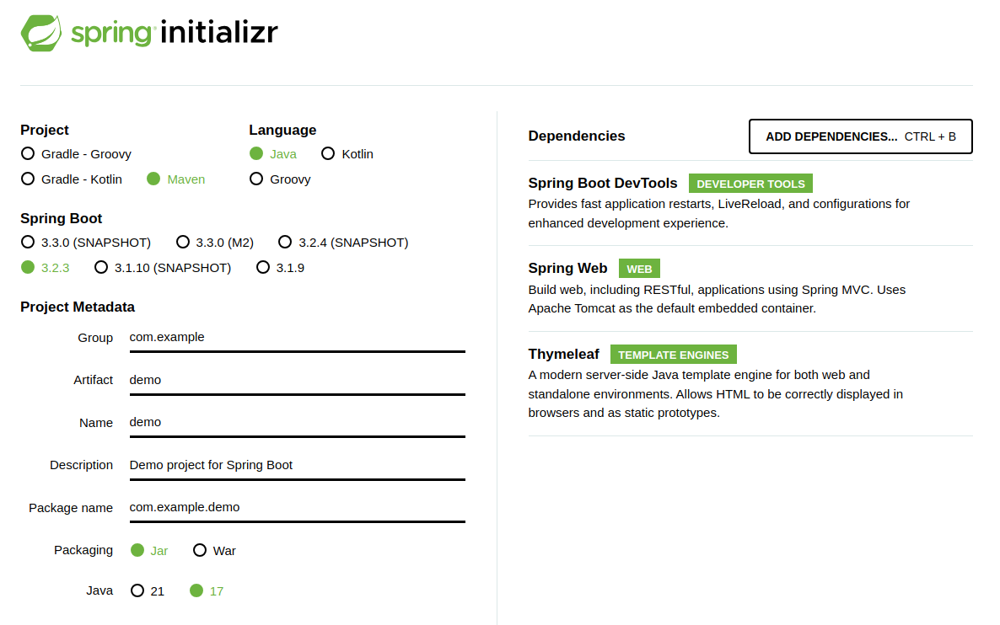
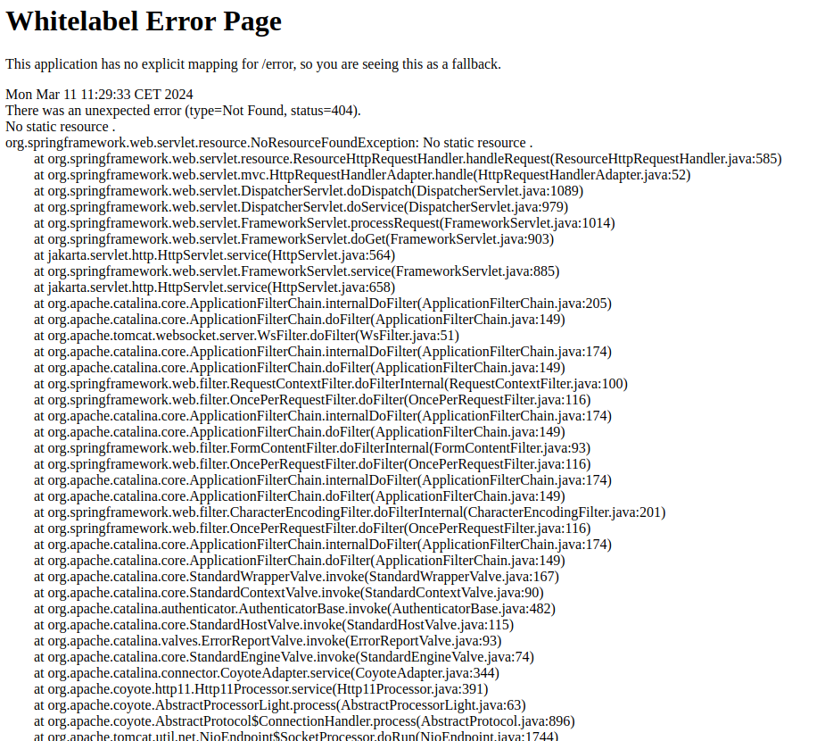

# Instalación del servidor SpringBoot

1. Configurar la demo en la página [spring initializr](start.spring.io) con Java Maven y la última version de SpringBoot. 
   
   - Las dependencias:
     
     - Spring Boot DevTools
     
     - Spring Web
     
     - Thymeleaf
   
   

2. Descargar el ZIP e importarlo a IntelliJ iDEA.

3. Ejecutar desde el editor y visitar localhost:8080.
   
   
   
   Es normal que la página de inicio sea un Error porque no hay ningún controlador configurado.

4. Crear controladores web y REST (`@Controller`, `@RestController`) en el directorio de nuestro package:
   
   - java class HolaWebController.java
   
   - Crear la página web hello.html
   
   - Crear un controlador REST para definir un endpoint REST simple

**Clase Java HolaWebController.java**

```java
import org.springframework.stereotype.Controller;
import org.springframework.web.bind.annotation.RequestMapping;

@Controller
public class HelloWebController {

    @RequestMapping("/helloweb")
    public String helloHandler(){

        return "hello.html";
    }
}
```

**Página HTML hello.html**

```html
<!DOCTYPE html>
<html lang="en">
<head>
    <meta charset="UTF-8">
    <title>Java Spring WebApp cifo</title>
</head>
<body>
hey .... this is amazing ... a- ma - zing
</body>
</html>
```

**Controlador endpoint REST**

```java
import org.springframework.web.bind.annotation.GetMapping;
import org.springframework.web.bind.annotation.RestController;

@RestController
public class HelloRestController {

    @GetMapping("/hellorest")
    public String helloWorld(){

        return "Hello Worlds and class!!!!";
    }
}
```

**TreeProject**

- Árbol de carpetas y clases:


5. Ejecutar el proyecto
   
   Haciendo clic en el botón "Ejecutar" o utilizando el método abreviado de teclado "Ctrl + Shift + F10".

6. Verificar los puntos finales.
   
   Una vez que la **aplicación** se esté **ejecutando** , puedes probarla accediendo a:
   
   * el **controlador web** en un navegador web yendo a
     
     * `http://localhost:8080/helloweb`
       
       hey .... this is amazing ... a- ma - zing
     - y el **controlador REST** en`http://localhost:8080/hellorest`
       
       Hello Worlds and class!!!!

    Se pueden añadir dependencias después de crear el proyecto en el archivo POM.xml, como es el caso de Lombok y data.Faker simplemente pegando la configuración y a continuación Maven se encarga de actualizarlo.

```xml
        <dependency>
            <groupId>com.github.javafaker</groupId>
            <artifactId>javafaker</artifactId>
            <version>1.0.2</version>
        </dependency>
        <dependency>
            <groupId>org.projectlombok</groupId>
            <artifactId>lombok</artifactId>
            <version>1.18.30</version>
            <scope>provided</scope>
        </dependency>
```