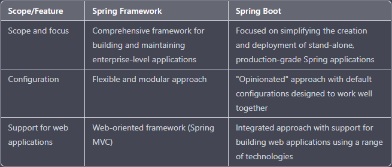

# Spring Framework

    Spring Framework es un potente marco de desarrollo de aplicaciones ligero que se utiliza para Enterprise Java (JEE) y que se utiliza para crear aplicaciones a nivel empresarial.

    Proporciona un conjunto completo de herramientas y bibliotecas para crear y mantener aplicaciones empresariales y está diseñado para admitir los “Principios de desarrollo de software de modularidad y desarrollo basado en componentes y programación no invasiva”.

    Consta de varios módulos, cada uno de los cuales proporciona un conjunto diferente de funcionalidades y herramientas. Algunos de los módulos clave:

* **Spring Core** : El módulo principal proporciona la funcionalidad fundamental de Spring Framework, incluida la inyección de dependencia, la inversión de control (**IoC**) y el soporte para *programación orientada a aspectos*.

* **Spring MVC** : El módulo MVC (**Modelo-Vista-Controlador**) proporciona un marco orientado a la web para crear aplicaciones web y admite el desarrollo de aplicaciones web utilizando un patrón de *front controller*.

* **Spring Data** : Módulo de datos proporciona *herramientas y bibliotecas* para trabajar con fuentes de datos y bases de datos, y admite el desarrollo de *aplicaciones orientadas a datos*.

* **Spring Security** : Módulo de seguridad que roporciona herramientas y bibliotecas para *implementar autenticación y autorización* en aplicaciones y admite el desarrollo de aplicaciones seguras.

* **Spring Boot** : Proporciona una manera de crear rápida y fácilmente aplicaciones Spring independientes y de nivel de producción. Spring Boot utiliza un enfoque "*obstinado*" para la configuración, lo que significa que proporciona un conjunto de configuraciones predeterminadas que están diseñadas para funcionar bien juntas y permite a los desarrolladores comenzar rápidamente *sin tener que dedicar mucho tiempo a configurar la aplicación*.

## Qué es Spring Boot

    Spring Boot es una **herramienta en línea** que nos permite crear un proyecto como con Spring Framework, solo que Spring Boot elimina ciertas configuraciones repetitivas requeridas para desplegar la aplicación o proyecto.

Entre las características de la herramienta Spring Boot se encuentran:

* Permite hacer una configuración automática para que Spring Framework funcione.
* Ofrece un servidor incorporado para evitar la complejidad en el despliegue (deployment) de una aplicación Spring.
* Cuenta con dependencias iniciales que simplifican la compilación y configuración de una aplicación Spring.

    Spring Boot genera una versión ligera de un proyecto Java, se puede usar para entornos ligeros como microservicios, APIs REST y similares.

## Diferencias entre Spring Framework y Spring Boot

* Spring Framework es un marco integral para crear y mantener aplicaciones de nivel empresarial en Java, mientras que Spring Boot se centra específicamente en simplificar el proceso de creación e implementación de aplicaciones Spring independientes de nivel de producción.

* Spring Framework proporciona un enfoque de configuración flexible y modular, mientras que Spring Boot utiliza un enfoque de configuración "*dogmática*", que proporciona un conjunto de configuraciones predeterminadas que están diseñadas para funcionar bien juntas.

* Spring Framework proporciona un marco orientado a la web llamado *Spring MVC*, mientras que **Spring Boot** proporciona un enfoque más integrado para el *desarrollo de aplicaciones web* e incluye soporte para crear aplicaciones web utilizando una amplia gama de tecnologías.

* En general, Spring Framework y Spring Boot son marcos útiles para crear aplicaciones de nivel empresarial en Java, pero **tienen diferentes alcances, enfoques y enfoques de configuración**, y pueden ser más o menos adecuados para diferentes tipos de proyectos y objetivos.

